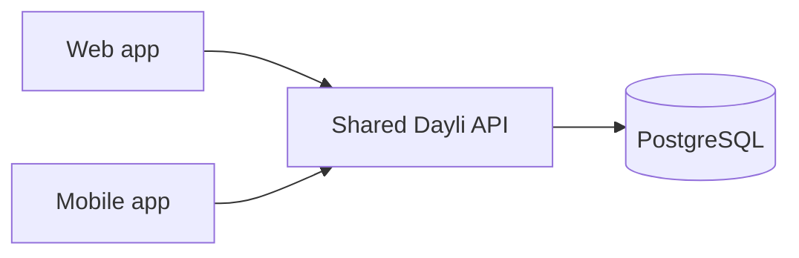

# docs

This is a Next.js application generated with
[Create Fumadocs](https://github.com/fuma-nama/fumadocs).

Run development server:

```bash
npm run dev
# or
pnpm dev
# or
yarn dev
```

Open http://localhost:3000 with your browser to see the result.

## Explore

In the project, you can see:

- `lib/source.ts`: Code for content source adapter, [`loader()`](https://fumadocs.dev/docs/headless/source-api) provides the interface to access your content.
- `lib/layout.shared.tsx`: Shared options for layouts, optional but preferred to keep.

| Route                     | Description                                            |
| ------------------------- | ------------------------------------------------------ |
| `app/(home)`              | The route group for your landing page and other pages. |
| `app/docs`                | The documentation layout and pages.                    |
| `app/api/search/route.ts` | The Route Handler for search.                          |

### Fumadocs MDX

Collections are defined with the [Macro API](https://fumadocs.dev/docs/mdx/macro) in `lib/source.ts`.

Read the [Introduction](https://fumadocs.dev/docs/mdx) for further details.

## Mermaid diagrams

Use fenced `mermaid` blocks in documentation files to draw architecture and system flows:

````md

````

Use flowcharts for architecture, sequence diagrams for request flows, and state diagrams for lifecycles. Put the diagram in the page that explains the system, with a short explanation of what it shows.

`lib/source.ts` converts these blocks into the `Mermaid` component registered in `components/mdx.tsx`. The renderer loads in the browser, follows the site's light or dark theme, and uses Mermaid's strict security mode. If a diagram has invalid syntax, the page shows its source instead of failing.

## Cloudflare deployment

From the repository root, run `pnpm --filter docs preview:cloudflare` to check the built Worker locally. `pnpm --filter docs deploy:cloudflare` deploys the `dayli-docs` Worker from your machine. The public docs live at `/docs`, not `/`.

Merges to `main` deploy automatically after the `CI` workflow succeeds. Before merging the deployment workflow, create a GitHub environment named `docs-production`, restrict it to the `main` branch, and set:

- Environment variable `CLOUDFLARE_ACCOUNT_ID`: the 32-character account ID for the Cloudflare account that owns the docs Worker.
- Environment secret `CLOUDFLARE_API_TOKEN`: a token scoped to deploying Workers in that account. Keep it out of repository-wide secrets.

The workflow checks the Worker name and bindings before deploying. It does not create an R2 bucket or attach a custom domain. After the first deploy, test the Worker URL, then attach the desired hostname under Cloudflare Workers & Pages > `dayli-docs` > Settings > Domains & Routes > Add > Custom Domain. Cloudflare manages the DNS record and certificate. Future deploys update the same Worker.

## Learn More

To learn more about Next.js and Fumadocs, take a look at the following
resources:

- [Next.js Documentation](https://nextjs.org/docs) - learn about Next.js
  features and API.
- [Learn Next.js](https://nextjs.org/learn) - an interactive Next.js tutorial.
- [Fumadocs](https://fumadocs.dev) - learn about Fumadocs
