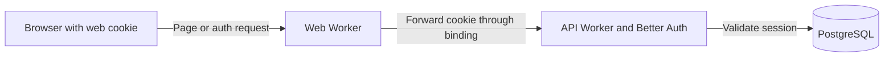
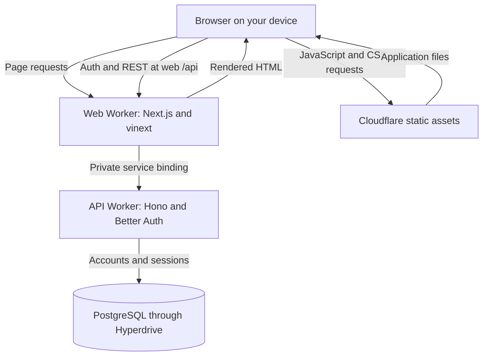
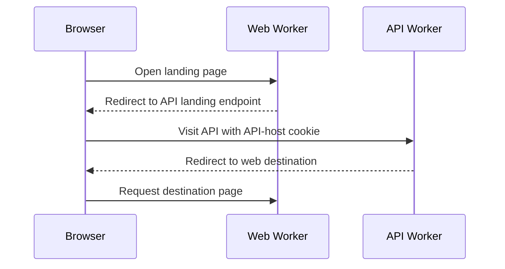
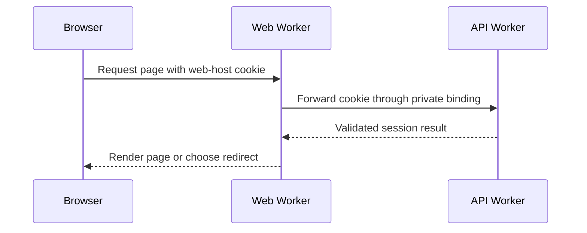
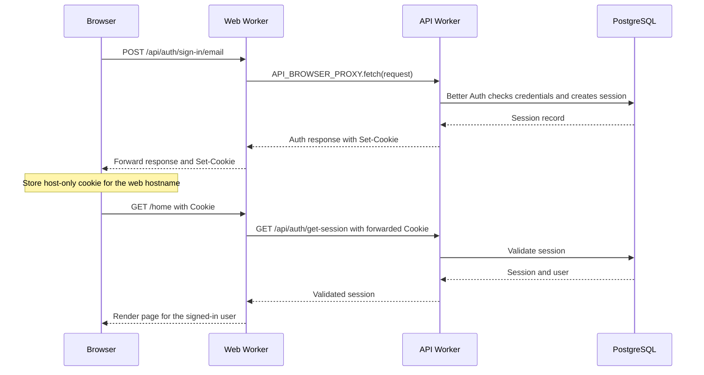
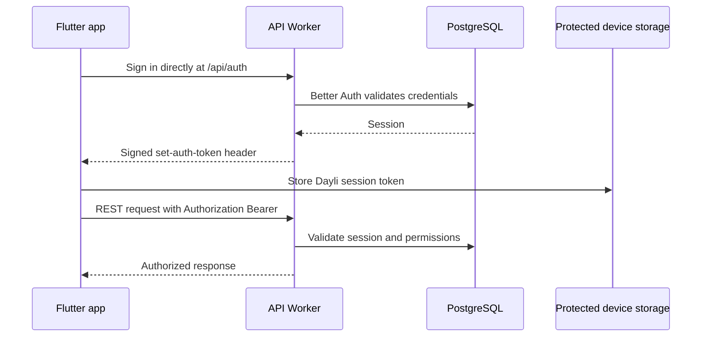

Signing in looks simple from the outside. Enter your details, press the button, and off you go. Behind that button, the browser, web server, and API each have a different job.

Dayli uses Better Auth in the shared backend. The web and mobile apps use the same accounts and sessions, but they carry their session credentials differently. Web uses a cookie. Mobile uses a bearer token stored on the device.


## A little context before we get into authentication

First, let's meet the three pieces involved: the browser, the web server, and the API. They pass requests between each other, but each has a different job. Knowing which one receives a request helps explain where the session cookie goes.

The **browser** runs on your device. It displays the page, runs the frontend JavaScript, and keeps cookies. React handles interactive parts of the page once its JavaScript loads. Hydration is the step where React connects that JavaScript to the HTML the server already sent.

The **web server** runs the Next.js web application. On Cloudflare, the staging web application runs as a Worker through vinext. It renders page HTML and supplies the application JavaScript and styles. Static assets can be served through Cloudflare's asset binding; they do not need to pass through the API.

The **web API**, or backend, is a separate Hono Worker. It handles data requests, runs Better Auth, checks permissions, and talks to PostgreSQL through Hyperdrive. It returns data and authentication responses rather than rendering the application pages.

The browser is on your device, while the web server and API run as two separate Cloudflare Workers. When we say "web server" or "web Worker", we mean the same thing.

For authentication, the short version is:



The response travels back along the same path. Page HTML comes from the web Worker; session validation happens in the API.

<details>
<summary>Show the full page, asset, and API flow</summary>



</details>

The browser can reach the web origin's `/api/*` paths, but those requests are forwarded to the backend. The web Worker does not become a second authentication service.

## Why we chose this design

Originally, browser authentication went directly to the API hostname. Better Auth set a host-only cookie there. That worked for browser API calls, but the browser did not send the API's cookie when requesting a page from the web hostname.

That distinction matters. A server-side `fetch()` does not magically inherit the browser's cookies for another host. Without the credential, the web server could not ask the API who was visiting its page.

The original problem was a visible flash of the wrong screen. You could already be signed in, open Dayli, and briefly see the public landing page before being redirected to your home screen.

The landing page waited for JavaScript to load, fetched the session, fetched username readiness, and then redirected. While those checks were pending, it could display the signed-out screen. The problem was this sequence of requests, not simply having two servers.

We chose to put browser authentication behind the **web origin**. A login response now reaches the browser through the web Worker, which lets the browser store a host-only cookie for the web hostname. Subsequent page requests carry that cookie to the web server. It can forward the credential to Better Auth and get a validated session while rendering.

This moves the landing decision out of the browser effect. When the server validates your session, it chooses `/home` or `/setup-username` instead of rendering the public landing screen first. That addresses the original signed-out screen flash without waiting for hydration to discover that you are signed in.

If session validation is unavailable, the public landing page still renders. This is a deliberate fallback, not a claim that every request redirects instantly.

The important part is where the browser receives the cookie, not which Worker originally generated it.

### Before and after in the page code

#### Before: the browser checks the session

Before the migration, the landing page used a client effect. This is an excerpt from the original page, with the UI omitted:

```tsx title="Before: client-side landing page"
'use client';

const router = useRouter();
const { user } = useSession();

useEffect(() => {
  if (!user) return;
  void getUsernameProfile().then((profile) =>
    router.replace(profile.needsUsernameSetup ? '/setup-username' : '/home'),
  );
}, [router, user]);
```

The browser had to load JavaScript and resolve the session before that effect could choose a destination.

#### After: the web server forwards the cookie

Now the landing page can ask the backend from the server. This is the current page flow, with imports omitted:

```tsx title="After: server-side landing page"
export default async function App() {
  if (browserProxyEnabled) {
    const guard = await resolveLanding(await headers(), await browserApiTransport());
    if (guard.state === 'redirect') redirect(guard.location);
  }
  return <LandingPage />;
}
```

`resolveLanding()` checks the session and username readiness using the incoming cookie and private API transport. Other server code can call `getServerSession()` when it only needs the session result:

```tsx title="After: checking the session from server code"
const result = await getServerSession();

if (result.state === 'authenticated') {
  // Use result.value.user and result.value.session.
}
```

That helper handles forwarding; it does not create a new session authority. Callers still handle signed-out, unavailable, and cookie-update results. Protected pages use the route guards rather than treating a cookie as proof of login.

#### Why a guard instead of just getSession and redirect?

We still use Next.js `redirect()` on the server. The guard decides where to go; Next.js performs the redirect. `router.push()` and `router.replace()` are for navigation from client components, not server-side page rendering.

A **guard** is our helper for deciding whether to render a page or send the visitor somewhere else. It is not a Next.js requirement. We could call `getServerSession()` and write the conditions directly in each page, but the landing page needs more than a yes-or-no session check:

- Signed-out visitors should see the public landing page.
- Signed-in visitors with a username should go to `/home`.
- Signed-in visitors without a username should go to `/setup-username`.
- Cookies that need updating must go through the session-refresh route.
- An unavailable session check should leave the public landing page visible.

`resolveLanding()` collects those decisions in one testable helper. The page calls it and either renders the landing screen or passes the returned destination to `redirect()`.

The migration is about making the cookie available to the server, not introducing guards. A plain server-side session request without the visitor's cookie cannot identify them. Our `getServerSession()` forwards that cookie through the API binding; the guards then apply the page's navigation rules. Protected API operations still enforce their own permissions.

### Why not the alternatives?

We considered redirecting the browser to an API landing endpoint and back. That endpoint could read its own cookie, but the extra navigation did not give the web server a reusable session check. It was an interim approach and was superseded by the proxy.

Here is that earlier redirect approach. The browser had to visit the API itself because only requests to that hostname carried its cookie:



With the web-host cookie, the web server can make the session request itself. The browser stays on the web origin:



The original client-side flow, the interim API redirect, and the selected binding proxy were three different stages. The proxy replaces the browser bounce with a server-to-server request.

A shared parent-domain cookie would also widen where the browser sends the credential. We kept the cookie host-only instead. The web-origin proxy gives the web server what it needs without sharing the cookie across sibling hosts.

We also kept Better Auth in the API rather than moving authentication into Next.js. Mobile needs the same session authority, and protected API operations still need their own checks. One backend owns those rules.

## Signing in through the web Worker

A Cloudflare **service binding** gives one Worker a configured connection to another Worker. In Dayli, `API_BROWSER_PROXY` points from the web Worker to the API's named `BrowserProxyEntrypoint`.

The browser cannot invoke that binding itself. It makes an HTTPS request to the web application, and server-side code calls the binding. The upstream destination is fixed in configuration, not supplied by the visitor.



The cookie is `Secure`, `HttpOnly`, and `SameSite=Lax`. Secure limits it to HTTPS. HttpOnly keeps frontend JavaScript from reading it. The browser still sends it on matching requests, so React does not need to copy a session token into local storage.

The proxy preserves individual `Set-Cookie` headers, including expiry and deletion attributes. It also preserves redirects instead of following them inside the web Worker. Authentication and personalized responses use `Cache-Control: no-store`.

Google sign-in uses the same forwarding path for its web callback. In proxy mode, the registered callback is the web origin followed by `/api/auth/callback/google`. Google proves identity; Better Auth creates the Dayli session. Matching an email address alone does not implicitly link an existing password account to Google. Linking is an explicit authenticated action.

## Checking a session before rendering

A page request brings the web cookie to the server. The server-side session helper forwards it through the private binding and asks Better Auth to validate it. Finding a cookie is not enough. It might be expired, revoked, or invalid.

Route-local guards use that result to decide whether to render, send the visitor to sign-in, or request username setup. Sign-in return destinations preserve the requested path and query, with validation to prevent external redirects. The public landing page remains public for signed-out visitors.

The server makes the navigation decision without first waiting for a browser session fetch. Next.js can communicate redirects through streamed rendering, so that does not always mean an HTTP redirect before any HTML is sent.

### When the cookie needs updating

A session lookup can return a refreshed cookie or tell the browser to clear an expired one. React Server Components cannot set cookies during rendering, so the session helper reports that an update is needed instead of silently dropping it.

The browser then visits `/auth/session-refresh`. That route repeats the session check, forwards the API's cookie headers on a real response, and returns the browser to a validated relative path. A short-lived marker bounds refresh loops. It is not a session or proof that someone is signed in.

## Forwarding credentials without trusting every header

Forwarding the cookie solves session access. It does not make every forwarded header trustworthy.

The web proxy strips caller-supplied forwarding and internal headers, preserves the browser's `Origin`, and builds the private source context used by the API. The named API entrypoint validates that context before the shared handlers use it for rate limiting.

A service binding does not automatically preserve a trustworthy original visitor IP. Public requests marked as coming from another Cloudflare Worker are rejected at both the web proxy and public API entrypoints. That prevents another Worker from choosing its apparent source through Worker subrequest headers. The private binding path is separate. Same-account permissions to configure bindings remain part of the trust boundary.

The API also checks trusted origins for cookie-authenticated mutations. CORS alone is not authorization: preventing a browser from reading a response would not prevent an unsafe request from changing data.

Page guards improve navigation. Every protected API operation still validates authentication and permissions independently. Skipping the page and calling the endpoint directly does not skip those checks.

## Mobile takes the direct route

Flutter does not need the web server to render pages. It talks directly to the public API and receives Better Auth's signed `set-auth-token` handoff after sign-in. The app stores that credential through `flutter_secure_storage` and sends it as `Authorization: Bearer` on later requests.



Browser WebSockets also stay direct to the API, using short-lived tickets obtained through REST. Signed media transfers stay direct to R2. The browser proxy is for REST and authentication, not a detour for every byte.

## Where to go next

The browser proxy is selected at build time with `NEXT_PUBLIC_WEB_API_PROXY_ENABLED` and an explicit web origin. Direct API mode remains available for rollout and recovery. Moving between cookie hosts requires another browser sign-in; existing cookies do not migrate themselves.

The binding is configured in `apps/web/wrangler.jsonc`. Its transport and forwarding code live in `apps/web/lib/api/server`, session guards in `apps/web/lib/session`, and the private API entrypoint in `apps/api/src/http/browser-proxy-entrypoint.ts`.

The rest of the authentication record is split by what you are trying to do:

- [How we got to the browser auth proxy](/docs/systems/accounts-and-authentication/migration-history) follows the original problem, the options we considered, the implementation surprises, and what staging taught us.
- [Authentication setup and operations](/docs/systems/accounts-and-authentication/setup-and-operations) covers local setup, Google, Resend, staging activation, coordinated deployment, and rollback.
- [Authentication security and verification](/docs/systems/accounts-and-authentication/security-and-verification) records the security findings, edge diagnostic, smoke-test history, exact evidence limits, and remaining checks.

The [API reference](/docs/api-reference) covers application endpoints under `/api/v1`. Better Auth owns `/api/auth/*` separately, so its routes are not generated into that reference.
