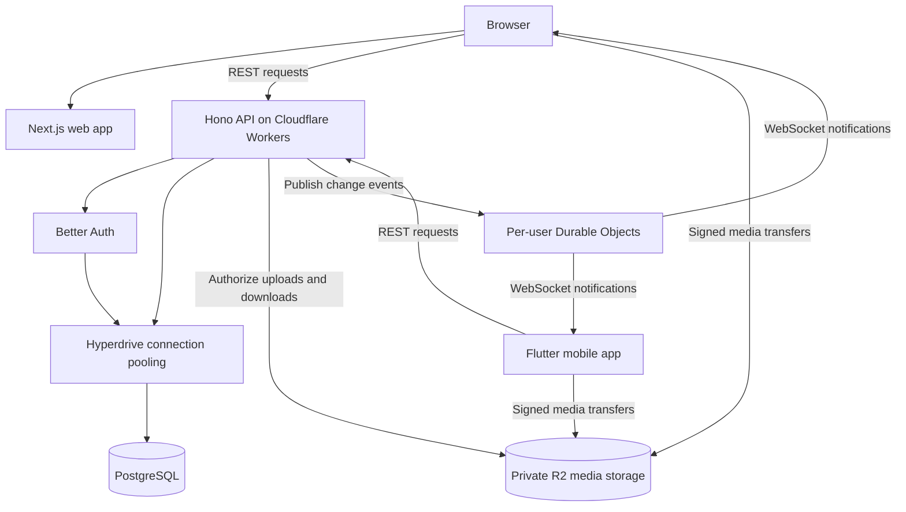

Two apps, one backend. Dayli's web and mobile clients have their own interfaces, but they talk to the same API. That is where we check permissions, decide which posting day it is, and store the things you share.

This page is the big picture. We will leave the individual endpoints to the [API reference](/docs/api-reference), and the list of tools to the [tech stack](/docs/development/tech-stack).

## The main pieces

This is Dayli's architecture. The clients share one backend, with PostgreSQL for application data, R2 for media, and Durable Objects for realtime notifications.

The browser can also send API requests through the web app's optional proxy. That mode uses a private Worker service binding to reach the same backend. It does not create a second set of business rules.

### Web and mobile

The web app lives in `apps/web`, and the Flutter app lives in `apps/mobile`. They handle screens, navigation, forms, and local state. Neither gets a database connection.

Both clients use generated API libraries. Hono routes and their Zod schemas produce an OpenAPI document, which we use to generate TypeScript and Dart clients and these API reference pages. The screens can look different without having to guess what the backend expects.

### The shared backend

`apps/api` runs Hono on Cloudflare Workers. Better Auth handles authentication under `/api/auth`, while the versioned REST endpoints live under `/api/v1`.

The backend checks the session, validates requests, and applies the rules for each feature. For example, a client can ask to create a daily post, but the server decides whether that author has already posted for the Auckland day. Changing the clock on your phone does not buy you another post!

### Database and media

PostgreSQL stores accounts, posts, relationships, messages, and media reservation records. The deployed database uses Neon. Hyperdrive pools the API's database connections; it is not another database or a place where we store posts.

The API uses a restricted application database role. Migration tooling connects separately with the migrator role. Updating the schema is a different job from serving someone's feed.

Images, videos, and voice memos live in private R2 storage, not inside PostgreSQL. The database tracks their ownership and associations. After authorizing the parent post, the API gives an owner or active friend a short-lived signed URL. Public-profile reads use a Dayli content route that checks the parent again on every request.

## Following a request

Most interactions take the same path. A client sends a request, the backend checks who is asking and what they are allowed to do, and PostgreSQL records or returns the result.

Authentication differs slightly between the clients. The browser sends a session cookie with credentialed requests. Mobile stores its session token in platform-protected storage and sends it as a bearer token. Both reach the same authorization checks.

Daily posts use server-owned Auckland dates and release rules. Choosing a `friends` audience does not make a post immediately readable. After release, active friends can read it, and a public profile also permits signed-in and signed-out profile and detail reads. The backend checks relationships, blocks, profile visibility, and release timing on each request. A `solo` post stays private to its author.

Likes and comments keep a narrower boundary. Their routes require a signed-in owner or active friend with a username, even when a public reader may open the parent post. The API support is active, but the current web and mobile interfaces do not perform those interaction writes.

## Media takes a small detour

Uploading an image does not mean sending the whole file through a normal post request. The client first asks the API for a media reservation. It then uploads directly to R2 using a signed URL and asks the API to verify the uploaded object.

Only validated reservations can be attached to a post. Reading media follows the same idea in reverse: the API checks access to the post before issuing a signed download URL or streaming the object through a parent-authorized route. Having an object key is not permission to view it.

## Messaging and background work

Messaging has REST routes, PostgreSQL records, and realtime delivery code. A per-user Durable Object manages hibernating WebSocket connections. Its notifications tell clients that something changed; clients fetch the authorized message state through REST rather than receiving message bodies over the socket.

The messaging outbox records delivery work in PostgreSQL. Immediate dispatch handles normal updates, and scheduled retries repair failed delivery. When provider and device configuration is present, FCM handles mobile push notifications.

Scheduled work also handles media cleanup. The restricted export Hyperdrive binding and explicit approval enable owner-scoped exports for all staging accounts, with an active staging web page and separate Android staging tester build. The earlier time-bounded single-owner proof is not the current staging mode. Separate production execution, ordinary mobile builds, public-registration approval, and destructive account cleanup remain disabled.

## Where to go next

For the tools behind these pieces, head to [Tech stack](/docs/development/tech-stack). To run them locally, start with [Local setup](/docs/development/local-setup). For request parameters and response shapes, pick an endpoint in the [API reference](/docs/api-reference).
