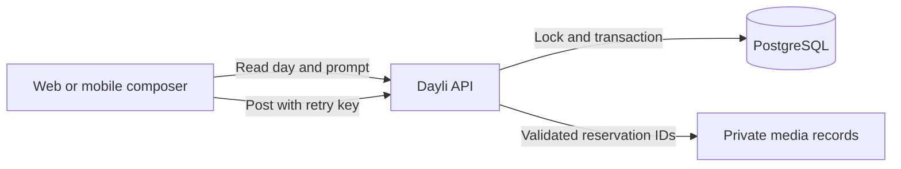
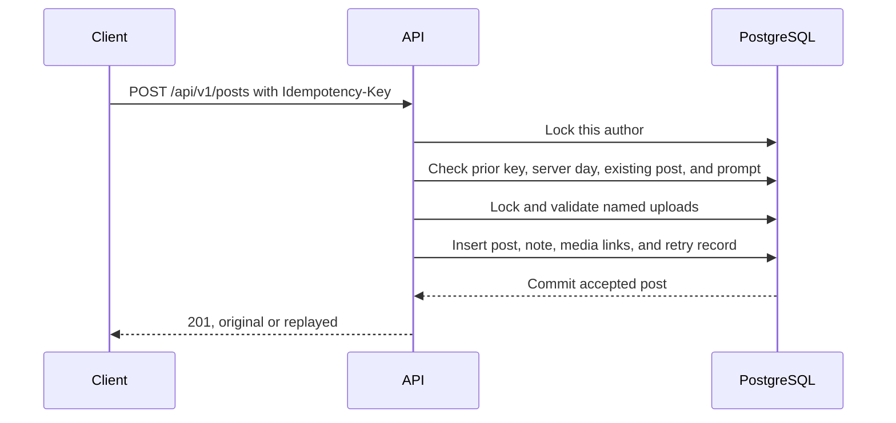

A daily post has a boundary that an ordinary form does not. Someone can start writing before midnight, lose their connection, and press Post after the day changes. Two devices can also submit at once. Dayli must decide which day the post belongs to without trusting either device clock, while keeping a safe retry from creating a duplicate.

The API owns that decision. It calculates dates and midnight boundaries in `Pacific/Auckland`, selects the prompt for that Auckland date, and accepts at most one active post per author and date. An accepted post is private until the following Auckland midnight unless its author reads it.

## Why the server owns the day

Using the device's date would make a changed or incorrect clock part of the permission model. Subtracting 24 hours is also wrong around daylight-saving changes, when an Auckland calendar day can contain 23 or 25 hours.

`packages/domain/src/auckland-day.ts` resolves the current Auckland date and both midnight instants from an injected server clock. The interval includes its starting midnight and excludes the next one. `GET /api/v1/posting-days/current` returns:

- `serverNow`, so a client can correct its countdown for clock skew;
- `localDate`, the server's Auckland calendar date;
- `deadlineAt` and `releaseAt`, both the next Auckland midnight;
- the active prompt ID and text;
- `hasPosted` for the authenticated author.

The prompt catalog contains one version-one prompt for every month and day, including February 29. Prompt rows are immutable. A replacement gets a new ID, version, and effective date, so an old post continues to point to the prompt it answered. If today's prompt is missing, the posting-day route fails instead of inventing one or silently using another day's prompt.

## Accepting one post

The composer sends the Auckland date and prompt ID it received, the reflective answer, rating, an optional caption, an optional tomorrow note, and an explicit `solo` or `friends` audience. There is no default audience. Flutter may also send validated media reservation IDs.

The API handles acceptance in this order:

A transaction-scoped author lock serializes submissions from different devices. The API reads its clock after taking that lock. Request arrival before midnight is not enough. The transaction must reach the acceptance decision while that Auckland day is still current.

The database adds a second guard with a unique index on `(author_id, local_date)` for active posts. A post in Trash does not occupy that index, which allows a replacement while the same day remains open.

The main conflict reasons are deliberately specific:

| Reason | Meaning |
| --- | --- |
| `POSTING_DAY_CLOSED` | The draft belongs to an earlier Auckland date. It cannot be backdated. |
| `POSTING_DAY_NOT_OPEN` | The draft claims a future Auckland date. |
| `ALREADY_POSTED` | Another active post already occupies this day. |
| `PROMPT_CHANGED` | The submitted prompt is not the active prompt for that day. |
| `MEDIA_NOT_READY` | An owned upload is still pending. |
| `MEDIA_UNAVAILABLE` | An upload is missing, expired, failed, claimed, already used, or belongs to someone else. These cases share one response. |

Only an accepted request consumes its idempotency key. This matters when an upload is still running or the prompt needs refreshing. The client can fix the problem and retry with the same key.

## Retries are part of the write model

For an accepted submission, `post_idempotency_keys` stores the author, key, post ID, and a SHA-256 fingerprint of the normalized request. The fingerprint includes every content field and, when present, attachment IDs in order.

An identical retry returns the original post with `201` and `Idempotent-Replayed: true`, even after midnight. Reusing the key with changed content returns `IDEMPOTENCY_KEY_REUSED`. If the original post has moved to Trash, a replay returns `POST_TRASHED` without returning hidden post content. The key remains used.

This is separate from the one-post-per-day constraint. The retry record answers, "Did this exact command already succeed?" The unique index answers, "Does this author already have an active post for this date?" Both are needed.

## Drafts on web and Flutter

The clients currently provide different levels of draft persistence.

**Flutter persists the whole draft.** It writes one per-account draft to `flutter_secure_storage`, backed by the iOS Keychain or Android protected storage. The record includes the Auckland date, prompt, text, audience, rating, tomorrow note, idempotency key, and attachment upload state. Edits are saved after a 400 ms delay and flushed before submission. A failed request keeps the draft. A `201`, including a replay, clears it.

Flutter can keep writing while offline if a saved draft is available. On reopening, a draft for an earlier Auckland date becomes read-only missed work. It is not relabelled as today's post. If midnight passes with the composer open, the app asks the server for the posting day again. If a submission is already in flight, it waits for that request to settle first. Flutter ignores author edits during that request, so a successful response cannot clear words added after the submitted snapshot.

**Web keeps the form only in React memory.** Its idempotency key survives retries while that mounted form remains open, but a reload, tab close, or navigation loses both the key and unsent fields. It does not write the draft to browser storage. The countdown stops at zero but does not reload the posting day by itself. A late submission lets the API reject the old day, and prompt or future-day conflicts trigger a refresh.

Web disables the Post button while a request is running, but its text fields remain editable. If the request succeeds, navigation can therefore discard words typed after the submitted snapshot. The web form also lets someone select media but currently submits text only and tells them the files stay on the device. These are current implementation limits. Do not describe web drafts as durable, offline-capable, or locked during submission.

## Media joins only at acceptance

Flutter compresses and uploads each attachment before posting. `POST /api/v1/posts` receives reservation IDs rather than file bytes. Inside the post transaction, the API locks those reservations and checks ownership, validation, expiry, cleanup state, prior use, type mix, count, and the 25 MB total. The post and `post_media` rows commit together.

That design prevents an object path or client claim from acting as attachment permission. The full upload and private download flow lives in [Media uploads and storage](/docs/systems/media-uploads-and-storage).

## A weather snapshot rides along

A post may carry one weather snapshot: a condition, a whole-degree Celsius temperature, and a place name. `POST /api/v1/posts` accepts it as an optional `weather` object. The schema is strict, so a `latitude`, `location`, or any other extra key is a validation error, and so is `weather: null`: the field is either a valid snapshot or absent.

The API checks shape and range, not truth. The condition must be one of `clear`, `partly_cloudy`, `cloudy`, `fog`, `drizzle`, `rain`, `snow`, or `thunderstorm`. The temperature is an integer from -90 to 60. The place name is trimmed, 1 to 80 characters (an emoji counts once), with no control characters. The phone fetches the weather itself, so the server cannot prove the snapshot is real. Describe it as the author's snapshot, never as verified.

Three nullable columns on `posts` store it, and database `CHECK` constraints repeat the rules and require all three to be present or all absent. No coordinates are stored, sent to the API, or logged. The snapshot is part of the idempotency fingerprint (version 3): a retry that adds, drops, or changes it conflicts with `IDEMPOTENCY_KEY_REUSED`, while posts without weather keep their earlier fingerprints. A snapshot is set when the post is created and cannot be added or changed afterwards, because the edit request is strict and has no `weather` field.

Only the created post and post detail return `weather` (an object or `null`). Feed, profile lists, revisions, and On This Day do not, and a test over the OpenAPI document keeps it that way. A snapshot has the post's access and retention, so anyone who can open the post can read the place name. It is also included in the author's account export.

On Flutter, the composer's **the weather** section is optional and never starts by itself. Tapping it opens an explanation first. **Use my location** is the only path to the system prompt, **Choose a place instead** searches by name with no permission at all, and **Not now** changes nothing. The app asks for approximate location only: Android declares `ACCESS_COARSE_LOCATION` and not the precise permission, and iOS requests low accuracy. It reads one position, cuts it to two decimal places, asks Open-Meteo for the current weather there, and takes the place name from the phone's own geocoder. The position is held in memory only, prints as a placeholder, and is never written to a draft.

Every Open-Meteo answer is validated before use: a finite, in-range temperature, a weather code from the standard table, a bounded body, and a position on Earth for each searched place. Anything else is treated as unusable data rather than guessed. Location refused, blocked, or switched off, a phone that cannot name its place, a lost connection, and a slow or failing provider each show a plain message and a way to choose a place, and none of them blocks posting. A lookup that is still running does hold the Post button, which reads **Getting the weather…**, because a snapshot that arrives after the request is sent cannot be added to the post. **Skip** cancels the lookup and lets the author post without weather, and a result that arrives after Skip is ignored. After iOS has asked once, the app points to Settings instead of prompting again.

The snapshot lives in the protected draft, so it survives restarts, prompt refreshes, and the retry after an expired upload. Flutter post detail shows it under the date as, for example, **Rain · 11°C · Auckland**, with Open-Meteo credited in the composer. The web composer does not offer weather.

## Release, audience, and later edits

Acceptance stores `released_at` as the next Auckland midnight. Before then, only the author can read the post. After release:

- `solo` remains author-only;
- `friends` can be read by active, unblocked friends;
- a released `friends` post on a public profile can also be read through profile and direct-detail routes.

The friends feed does not show today's newly accepted post. It shows the Auckland date released at the most recent midnight. [Friends and feed visibility](/docs/systems/friends-and-feed-visibility) explains that read policy and the difference between feed, profile archive, and detail.

An author may later edit the answer, caption, rating, or audience. The prompt, Auckland date, media, weather, and tomorrow note do not change. A real change stores the previous version as an immutable revision in the same transaction. The request carries `expectedRevisionCount`, so a stale editor gets a conflict instead of overwriting another edit. Sending the already-saved values is a no-op, which also makes an edit retry safe. [Reflection and history](/docs/systems/reflection-and-history) follows the archive, detail, revision, tomorrow-note, and Trash flows.

Moving a post to Trash hides it from normal post, revision, and media reads immediately. Restore and cleanup code exists, but the owner Trash routes and destructive worker remain opt-in and disabled by default. This is different from ordinary editing and should not be presented as generally activated deployment behavior.

## Tomorrow notes stay separate

A tomorrow note is stored in `tomorrow_notes`, not in the post or its revision history. Its `available_on` date is the next Auckland date. The permission helper requires both the author identity and an Auckland date on or after that date.

Post creation returns only the availability date. Feed, profile archive, post detail, media, and revision projections never return the note text. The current API contains the storage and visibility helper, but no user-facing route or client screen for reading the note was found in the checked-in implementation. The privacy rule is implemented at the data and permission layers, while the retrieval experience is still missing.

## What the implementation taught us

- Calendar boundaries should be calculated as Auckland midnights, not as elapsed 24-hour periods.
- The authoritative deadline check belongs after the author lock, close to the accepted write.
- Idempotency and domain uniqueness solve different races.
- A client should freeze author edits while submitting, or it may clear words that were never part of the accepted request. Flutter does this. Web currently disables only the Post button.
- Private future content needs its own projection. Leaving tomorrow notes out of ordinary post objects makes an accidental feed leak less likely.
- A countdown is interface help, not permission. The server still decides whether the day is open.

## Code and verification

The main API code is under `apps/api/src/features/posting-days` and `apps/api/src/features/posts`. Auckland date handling is in `packages/domain/src/auckland-day.ts`, and post tables are in `packages/db/src/schema/index.ts`. Web composer code is under `apps/web/app/(main)/post`; Flutter draft and composer code is under `apps/mobile/lib/drafts` and `apps/mobile/lib/compose`, and its weather lookup is under `apps/mobile/lib/weather`.

Unit tests cover normal days, both daylight-saving transitions, leap day, prompt selection, conflict mapping, deadline refresh, send locking, and idempotent replay. PostgreSQL integration tests cover the author advisory lock, one active post per day, media association, Trash replay behavior, and transaction rollback. The database-backed suites require the repository's isolated PostgreSQL fixture and are not proof of a deployed environment.
