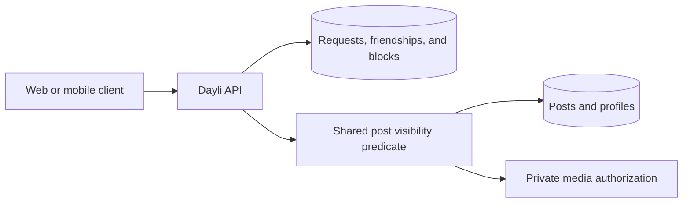
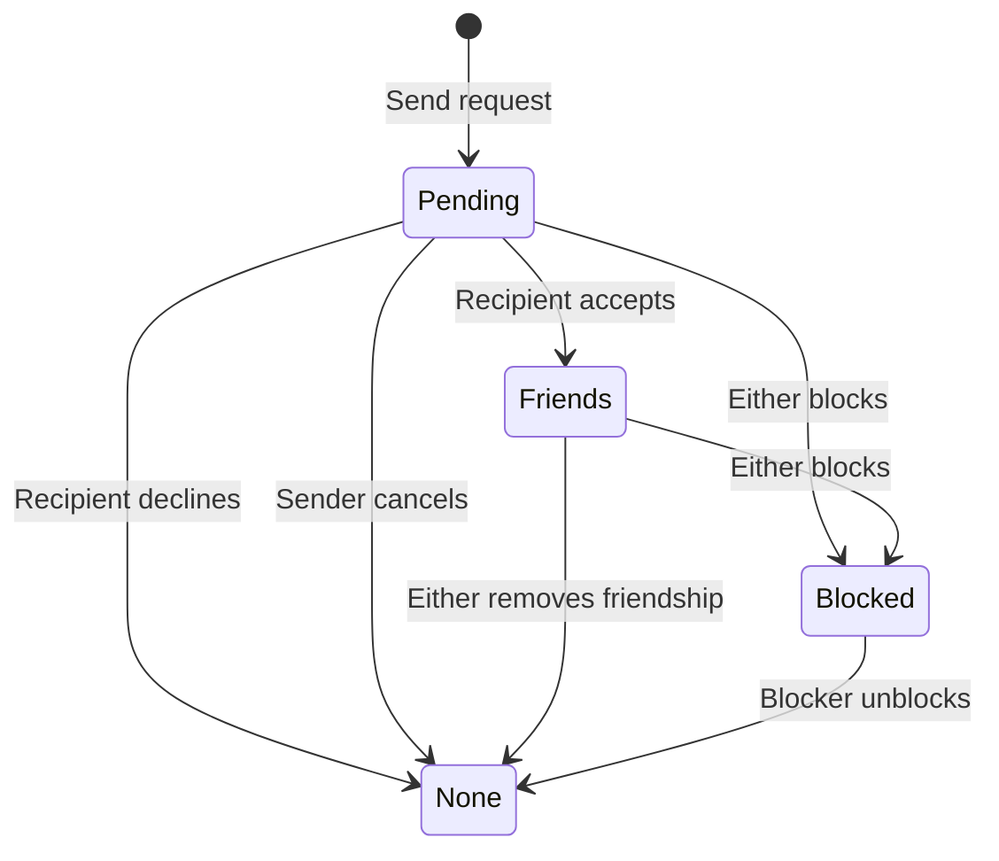
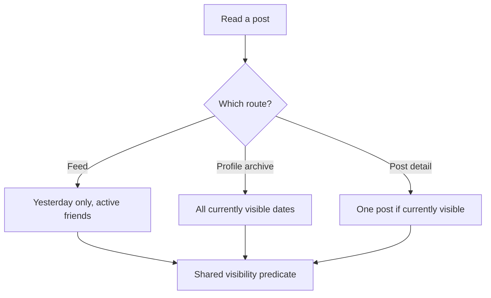

A friend button and a feed are one permission system. Accepting a request can reveal years of released posts. Removing a friendship must remove that access on the next read. Blocking must also hide search and profile results without confirming that a hidden account exists.

Dayli keeps relationship state in PostgreSQL and makes post visibility a server-side query predicate. Web and Flutter can hide buttons and clear cached pages, but those interface changes are not authorization.

## Why relationships and reads share a boundary

The older application had useful friend and feed behavior, but permission checks were spread across queries. It also found "yesterday" by subtracting 24 hours. That approach can disagree with Auckland calendar midnight around daylight-saving changes.

The current design separates three concerns:

- relationship commands decide whether a request, friendship, or block transition may happen;
- a shared post predicate decides whether the current reader may see a post now;
- each endpoint adds its own narrower purpose, such as yesterday only for the feed.

Putting visibility in the database query matters. Filtering after pagination could expose counts or create page holes where hidden posts were removed. Every post list applies the predicate before its limit and cursor.

## Friend request lifecycle

A relationship between two accounts can have no active state, one pending request, an active reciprocal friendship, or an active block.

The sender creates a request. Only the recipient can accept or decline it, and only the sender can cancel it. A pending request in the other direction is not treated as acceptance. The recipient must accept the existing request explicitly.

An accepted friendship writes two directional `friendships` rows in one transaction. Read policy requires both rows to be active. This prevents a stale one-sided row from granting journal access. Removing a friend ends both rows.

Each write locks the account pair in a stable order and uses a transaction-scoped advisory lock for that unordered pair. The lock prevents two concurrent sends, a send and block, or crossed updates from creating a state that the interface cannot represent.

Terminal request rows are retained. A declined or cancelled request can be sent again, but one sender may create at most five requests to the same recipient in a rolling 24-hour window. Blocking cancels pending requests and ends both friendship rows in the same transaction. Unblocking removes the block, but it does not restore the friendship or old request.

Relationship state also affects direct messages, but existing conversation history has its own participant check. A block stops new peer-visible message actions without using the friend table as message-history authorization. See [Messaging](/docs/systems/messaging) for that separate rule.

## Search and profile privacy

Username search is an authenticated discovery exception. It starts after at least two characters and matches a case-insensitive username prefix. It does not search email, public name, or biography.

A result contains only the account ID, username, display name, and the viewer-specific relationship state. Private accounts can appear because discovery is needed to send a request. That narrow card does not grant profile or journal access.

Search excludes:

- the person searching;
- accounts without a username;
- blocked accounts in either direction;
- banned accounts while the ban is active;
- accounts whose lifecycle is no longer active.

The API stores a per-account search quota in PostgreSQL, capped at 30 searches per 60-second window. This is persistent across Worker isolates. Search and friend-list cursors use lowercased username plus account ID for stable ordering.

There is no public blocked-user directory. A blocked username, an unknown username, an inactive account, and a banned account all resolve as unavailable on profile and relationship-card reads. This concealment is intentional.

Profile visibility controls what non-friends can read:

| Reader | Private profile | Public profile |
| --- | --- | --- |
| Account owner | Full details and every own post | Full details and every own post |
| Active friend | Full details and released `friends` posts | Full details and released `friends` posts |
| Other signed-in or anonymous reader | Generic restricted profile, no posts | Public details and released `friends` posts |
| Blocked in either direction | `404` | `404` |

`solo` and unreleased posts remain owner-only even when the profile is public.

## The authoritative post predicate

`buildDrizzlePostVisibilityFilter` in `apps/api/src/features/permissions/drizzle.ts` is the shared database predicate for post detail, profile archives, the feed, revisions, exports, and media. It checks the current post and account state rather than trusting an earlier page or revision.

For normal reads it first excludes posts in Trash and authors whose account lifecycle is not active. A known signed-in block in either direction denies access before any public-profile grant. It then applies the route's action:

- the author can read their active post before release and can read `solo` posts;
- another reader needs a released `friends` post;
- feed and private signed-download actions require an active reciprocal friendship;
- detail, profile, and parent-authorized media routes also allow a public-profile read;
- export is owner-only;
- media must still have a current, attached `post_media` row.

Unreadable detail, revision, and media resources return the same `404` as unknown IDs. The API does not reveal whether the post exists, whether a block caused denial, or whether a media ID was detached.

## What "yesterday" means in the feed

`GET /api/v1/feed` is authenticated and friend-only. It returns posts whose `localDate` is the Auckland date immediately before the server's current Auckland date. In other words, it shows the day released at the most recent Auckland midnight.

A post appears only when it:

- belongs to that one feed date;
- has the `friends` audience and has been released;
- belongs to an active reciprocal friend;
- is not blocked in either direction;
- belongs to an active account with a username;
- was not authored by the viewer.

Today's accepted post is absent until midnight. A friend's older posts are absent because the feed is deliberately one day wide. Both remain available through the appropriate profile archive when its policy permits them.

This route distinction explains a common surprise. A new friendship does not put old posts into today's feed, but it does grant the new friend access to earlier released `friends` posts on the profile. Removing the friendship removes private-profile archive and detail access on the next request. A public profile can still grant public access unless either account has blocked the other.

## Pagination and midnight changes

Feed, profile archive, friends, requests, and search use opaque keyset cursors rather than page numbers.

Post pages are ordered by `(localDate, id)` descending. Those values do not change when an author edits content or audience, so an unchanged post is not repeated or skipped across pages. Feed and profile post limits default to 20 and allow at most 100.

Every feed response includes `feedDate`. A cursor issued for the previous feed day becomes stale at Auckland midnight. The API returns `409` with `details.reason = "feedDayChanged"` and the new feed date. Web and Flutter then restart from the first page. Web also refreshes when its window regains focus, and Flutter refreshes when the app returns to the foreground.

Relationship lists use their own cursors. Friends and search sort by lowercased username and account ID. Pending requests sort by creation time and request ID. Altered or endpoint-incompatible cursors fail validation rather than being treated as an empty page.

## Private media follows the parent post

Feed pages read media only after post visibility has filtered the rows. The API then issues five-minute private R2 URLs for the active friend or owner. Profile and direct-detail reads do the same for authorized signed-in readers.

Public-profile readers receive a Dayli content route instead of an anonymous bearer URL. That route checks the parent post and attachment on every request. Unfriending, blocking, changing the audience to `solo`, changing a profile to private, or moving the post to Trash stops new authorized reads. An already issued five-minute signed URL and a downloaded copy cannot be recalled.

The storage, refresh, and public streaming paths are covered in [Media uploads and storage](/docs/systems/media-uploads-and-storage).

## Edits, deletion, and account lifecycle

Visibility is evaluated against the post's current audience. An author can change `friends` to `solo`, which removes the current post from other readers on their next request. Revisions keep older content, but a non-author can read only revisions that were themselves shared with friends. A solo-era version does not become visible merely because the current post later changes to `friends`.

A post in Trash is excluded from feed, profile, detail, revision, and media predicates immediately. Account lifecycle has the same immediate read effect: once an account is no longer active, its profile, relationship discovery, lists, and normal posts are hidden. Physical account and media cleanup is a separate fenced process. Its destructive execution is disabled by default, so immediate concealment should not be confused with completed purge.

The authentication system supplies the verified actor for all signed-in reads and commands. Cookie and bearer handling are explained in [Accounts and authentication](/docs/systems/accounts-and-authentication). No endpoint accepts a viewer ID from a query or request body as proof of identity.

## What changed from the older records

Some earlier records in `docs/dayli/friends-feed.md`, `profile-archive.md`, and `profiles.md` describe profile posts as friend-only or refer to proposed shared links. The checked-in permission predicate and current product decision now allow anonymous and non-friend reads of released `friends` posts when the author's profile is public. There are no public share tokens.

The current code is the source for this page. The older files remain useful history, but their friend-only public-profile wording should not be used to implement a new route.

## What the implementation taught us

- A friendship grant requires both reciprocal rows, while one active block in either direction is enough to deny access.
- Blocking is a state transition, not a hidden button. It ends friendships and pending requests atomically.
- Search can reveal enough to start a request without revealing a private profile.
- Visibility belongs inside the SQL query before pagination.
- Feed date and release time are related but not interchangeable. The feed adds a one-day product filter on top of the general release predicate.
- Public media needs a parent-authorized route. A reusable anonymous signed URL cannot react immediately to a privacy change.
- Returning `404` for hidden resources avoids turning detail and media endpoints into account or content probes.

## Code and verification

Relationship actions are under `apps/api/src/features/relationships`; post permissions are under `apps/api/src/features/permissions`; feed, detail, revision, and profile archive actions are under `apps/api/src/features/posts`. The schema is in `packages/db/src/schema/relationships.ts` and `packages/db/src/schema/index.ts`. Web friend and feed screens live under `apps/web/app/(main)` and `apps/web/features/feed`. Flutter uses `apps/mobile/lib/friends`, `home`, `profile`, and `posts`.

Route tests cover authentication, validation, storage failure concealment, and cursor errors. PostgreSQL integration tests cover reciprocal friendships, request races and throttles, block direction, lifecycle filtering, public and private profiles, release at midnight, hidden posts, stable pagination, and stale feed days. Web and Flutter tests cover account-keyed state, refresh races, pagination, and hidden-post removal. These local suites prove checked-in behavior against their fixtures, not Cloudflare, Neon, or R2 deployment state.
