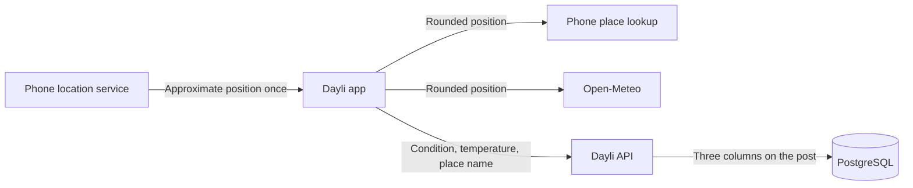

A line like "Rain · 11°C · Auckland" looks like a small decoration on a post, but the way it is made touches something people care about. Finding the weather means knowing roughly where someone is, and a diary app has no business keeping that. Dayli needs the weather without becoming a record of where its authors have been.

Dayli's answer is to keep the location on the phone. When the author chooses to add the weather, the phone reads its approximate position once, asks a weather service what it is like there, and sends the API only three things: a condition, a whole-degree temperature, and the name of a place. The position is used and forgotten, and the author can see exactly what will be posted before they post it.

The API and the database never see a coordinate. Only the weather service and the phone's own place lookup do, and they receive a position rounded to about a kilometre.

## What the current feature supports

- **Mobile only.** The Flutter composer has an optional **the weather** section. The web composer has none.
- **Optional and explained first.** Nothing is requested when the composer opens. Tapping **Add the weather** opens an explanation, and the system's location prompt can only follow **Use my location** in that explanation.
- **Two ways to add it.** The phone's location, or a place the author searches for by name, which needs no location permission at all.
- **Previewed and removable.** The composer shows the finished line before posting, with a close button to remove it.
- **Detail only.** The weather appears on the post detail screen under the date. Feeds, profile lists, revisions, and On This Day do not carry it.
- **Set once.** A snapshot is chosen while writing the post. It cannot be added, changed, or removed after the post is accepted.

## Why the phone fetches the weather

The weather could have come from the API: the phone would send its position, and the server would ask the provider. That would let the server check where the weather came from, but it would also mean every author's position travels to Dayli, and the provider would need a key that Dayli has to guard.

Dayli chose the other direction. The phone asks [Open-Meteo](https://open-meteo.com) directly, which needs no key, and sends the API only the result. This has a cost that the documentation should not hide. The server never sees the provider's answer, so it can check that a snapshot has the right shape and ranges but cannot prove the weather is real. Dayli describes a snapshot as the author's own, never as verified.

Open-Meteo's free tier is for non-commercial use and asks for attribution, which the composer shows next to the weather it adds. A commercial release needs a paid plan or another provider, and that decision is still open.

## Asking for location

The flow follows a simple rule: the app works without permission, so the permission can be asked for politely.

1. The author taps **Add the weather**. A sheet explains that Dayli uses an approximate location once, does not store it or send it to Dayli, and puts only the weather, temperature, and place name on the post. It also says the weather comes from Open-Meteo and that the phone looks up the place name.
2. The sheet offers **Use my location**, **Choose a place instead**, and **Not now**. **Not now** changes nothing, and the author can add the weather another time.
3. Only **Use my location** can reach the system prompt. Android declares `ACCESS_COARSE_LOCATION` and not the precise permission, so its dialog offers approximate location only. iOS asks for the when-in-use permission with a usage string that says the same thing, and the app requests low accuracy.
4. If permission is already granted, there is no second prompt. If iOS has already refused once, it will not ask again, so the app points to Settings and offers the search instead.

Every way this can fail has a plain message and a way forward, and none of them stops the author posting:

| What happened | What the author sees | What they can do |
| --- | --- | --- |
| Permission refused, but the system may ask again | "Dayli can't see where you are." | Choose a place, or try again |
| Permission refused for good, or restricted | "Location is turned off for Dayli." | Open Settings, or choose a place |
| Location switched off on the whole phone | "Location is switched off on this phone." | Open the location switch, or choose a place |
| The phone cannot find its position in time | "Couldn't find where you are." | Try again, or choose a place |
| The phone cannot name the place | "Couldn't tell which place you're in." | Choose a place |
| No connection, or a slow or failing provider | A message naming the problem | Try again, or choose a place |
| The provider sends something unusable | "The weather service sent something Dayli could not use." | Try again, or leave the weather out |

### Reading the position once, and stopping

The app asks the phone for one position, and it makes sure the phone stops looking whichever way that ends. It does this with a location subscription that it cancels when a fix arrives, when the wait times out after twelve seconds, when the author taps **Skip**, and when the composer closes.

The obvious alternative, a single `getCurrentPosition` call with a time limit, does not do this on iOS. In the plugin version Dayli locks, the time limit only stops the Dart code waiting. The native location request keeps running until it finds a fix. Cancelling a subscription is what calls the native stop, so the app uses one.

A subscription can hand over the phone's last known position first, and that may be old. The app skips any position older than ten minutes and waits for a fresh one, and gives up at the timeout.

The position is held in memory and printed as a placeholder, so a stray log line cannot leak it. It is cut to two decimal places before it goes anywhere, and it is never written to a draft, a request, or a log.

## Checking what the provider says

Open-Meteo is treated as an outside party whose answers need checking. Every response is validated before it is used:

- The temperature must be a finite number between -90 and 60, and is rounded to a whole degree.
- The weather code must be one the standard table defines. Dayli folds the table into eight conditions the API accepts. Codes 0 and 1 are `clear`, 2 is `partly_cloudy`, 3 is `cloudy`, 45 and 48 are `fog`, 51, 53, 55, 56, and 57 are `drizzle`, 61, 63, 65, 66, 67, 80, 81, and 82 are `rain`, 71, 73, 75, 77, 85, and 86 are `snow`, and 95, 96, and 99 are `thunderstorm`. A code outside the table is rejected, not guessed.
- The body is read as it arrives and abandoned past 64 KB, so a misbehaving server cannot make the app read an unbounded response.
- A failure never carries the request address, because that address contains the position.

Searching for a place uses Open-Meteo's place search. The search waits for a pause in typing, skips fewer than two characters, and returns at most eight places, each labelled with its region and country so that two towns with one name can be told apart. Each result is checked for a clean name and a position on Earth, and a bad entry is dropped without hiding the good ones. The name a post stores is the place's name alone, cleaned the same way as a name from the phone: tabs and line breaks become spaces, other control characters are removed, and anything longer than 80 characters is cut.

## What the API accepts and stores

`POST /api/v1/posts` takes an optional `weather` object with `condition`, `temperatureC`, and `placeName`. The schema is strict, so an extra key such as `latitude` or `location` is a validation error, and so is `weather: null`: the field is either a valid snapshot or absent.

- **Shape and range.** The condition is one of the eight values. The temperature is an integer from -90 to 60. The place name is trimmed, 1 to 80 characters (an emoji counts once), with no control characters, including the C1 characters that a simple "no newline" check would miss.
- **Stored with the post.** Three nullable columns on `posts` hold it, and database `CHECK` constraints repeat the rules and require all three to be present or all absent. The migration adds them as `NOT VALID` and validates them in a second transaction, which is safe because the new columns start empty.
- **Part of the retry fingerprint.** The snapshot is included in the idempotency fingerprint, so a retry that adds, drops, or changes it conflicts with `IDEMPOTENCY_KEY_REUSED`. Posts without weather keep their earlier fingerprints, so keys stored before this feature still match their retries.
- **Detail only.** The created post and post detail return `weather` as an object or `null`. A test over the OpenAPI document checks that those schemas, and the create request, are the only ones that carry the field.
- **Same access as the post.** Anyone who can open the post can read the place name, including a signed-out reader of a public profile's post. The snapshot is included in the author's account export and removed with the post.
- **Never edited.** The edit request is strict and has no `weather` field.

## How the composer behaves

The snapshot lives in the protected draft, so it survives restarts, prompt refreshes, and the retry that follows an expired upload. The draft keeps only the three fields, and a stored snapshot that fails the API's limits is dropped on load, so a corrupted draft can never make a post fail validation.

The weather section sits below the rating, so the rating stays near the top for entry points that open the composer with it already chosen.

A lookup that is still running holds the **Post** button, which reads **Getting the weather…**. A snapshot that arrives after the request has been sent cannot be added to the post, and the composer ignores edits while a submission is in flight, so posting early would silently lose it. **Skip** cancels the lookup, stops the phone's location request, and lets the author post without weather. A result that arrives after **Skip** is ignored.

## What the implementation taught us

- A time limit on a native call can stop the wait without stopping the work. Cancel the thing that holds the resource, and test that it was cancelled.
- A result that arrives after a submission is sent is lost. Hold the submission, or give the author a clear way to give up on the result.
- Every copy of a draft or a post is a chance to drop a field. `PostDetail.copyWith`, added for like and comment counts while this feature was in review, would have discarded the weather on every like. It was caught while merging, and a test now pins it. Each copy path needs the field and a test that proves it survives.
- Validate at each boundary. The app checks the provider, the API checks the request, and the database checks the row, because each can be reached by something the others did not see.
- Control characters are wider than newline. C1 characters such as `U+0085` pass a naive check, and a tab inside a name should become a space, not vanish and join two words.

## Current limits

The checked-in implementation covers the whole path above. It does not mean every part has been seen on a device.

On October 4, 2026 the flow was run once on an Android emulator against a local API: the explanation, the approximate-location dialog, a refusal, place search with live Open-Meteo data, posting, and the detail line. That run also confirmed the stored row held only the three fields and that the API log contained no place name or position. "Use my location" timed out on the emulator, which has no network location source, and fell back correctly to the message above. 

- **Google's Location Accuracy dialog.** On Android the plugin's default mode uses Google Play Services, which can show its own "Location Accuracy" dialog after permission is granted. Forcing the platform `LocationManager` would avoid it, but that has not been tested on a phone and could make a coarse-only lookup slower, so the default stays.
- **Provider licence.** Open-Meteo's free tier is non-commercial. The choice must be revisited before a commercial release.
- **Not verifiable.** The server cannot confirm a snapshot, because the phone fetches it.
- **Place names vary.** The name comes from the phone's geocoder, so its language and detail differ between devices, and a phone without one always falls back to searching.

The [known gaps](/docs/decisions-and-future-work/planned-systems-and-known-gaps) page tracks the open decisions.

## Code and verification

The API contract and validation are under `apps/api/src/features/posts/shared` (`post-weather.contract.ts` and `post-weather.ts`) and `apps/api/src/features/posts/create-post`. The columns, limits, and constraints are in `packages/db/src/schema/index.ts` and the `0056_post_weather` migration, which also replaces the account export function so a user's export includes the snapshot. The export inventory in `packages/db/src/export` lists the new columns. The phone-side lookup is under `apps/mobile/lib/weather`, the composer pieces are `weather_input.dart` and `weather_input_controller.dart` in `apps/mobile/lib/compose`, the draft field is in `apps/mobile/lib/drafts`, and the line on post detail is `apps/mobile/lib/ui/weather_line.dart`.

Route tests cover valid and invalid snapshots, replay and conflict on retry, the detail-only rule, and rejection of weather on edit. PostgreSQL tests cover every constraint, the stored columns, the export, and who can read a snapshot. Flutter unit tests cover the code table, the provider's every failure path, position rounding, and the open-request count for each way a location lookup can end. Widget tests cover the explanation, each permission path, place search, the held **Post** button, **Skip**, saved drafts, and the detail line. The database-backed suites need the repository's local PostgreSQL fixtures and are not proof of a deployed environment.

See [Daily posts and release timing](/docs/systems/daily-posts-and-release-timing) for how a post is accepted. [Creating your daily post](/docs/using-dayli/creating-your-daily-post) and [Privacy and sharing](/docs/using-dayli/privacy-and-sharing) describe the same feature for readers, and the [API reference](/docs/api-reference) lists the request and response schemas.
