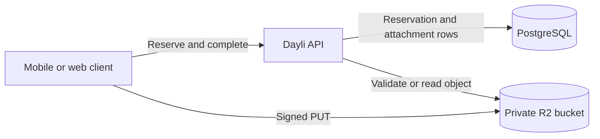
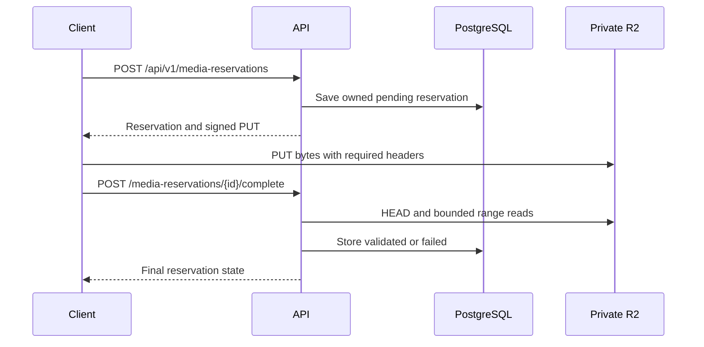
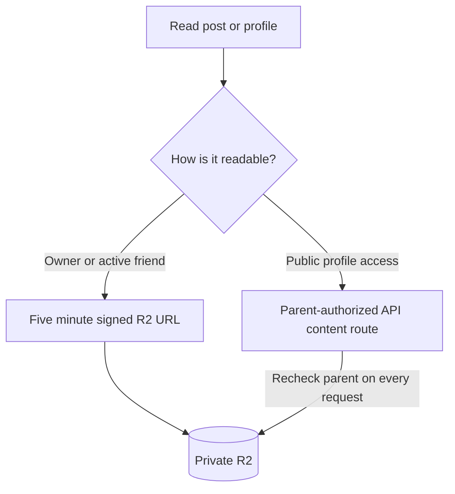

A photo looks like one field on a post, but storing it safely takes several steps. Dayli must accept a large file without routing all its bytes through the API, check that it is really the type and size the client claimed, and stop it becoming public just because someone knows its storage address.

Dayli handles those jobs with a **media reservation**. The API creates a short-lived upload slot for one user and one object. The client uploads directly to a private Cloudflare R2 bucket, then asks the API to inspect the stored object. A post can use the reservation only after that inspection passes.

The bucket stays private. R2 object keys and credentials never become application identifiers. PostgreSQL records ownership, validation state, and the post or profile that currently uses an object.

## Why the upload is split into stages

The documented design moved away from the older Cloudinary upload path while rebuilding the backend. It selected private R2, direct transfer, upload quotas, validation, and orphan cleanup. This split addresses three different problems.

A normal upload through the Worker would make the API receive every byte and then send those bytes to storage. Direct upload avoids that extra transfer. Making the bucket public would simplify display, but anyone with a permanent object URL could bypass post visibility changes. Trusting a file extension or request `Content-Type` would be cheaper, but those values do not prove what reached storage.

The selected design keeps the useful part of each alternative without accepting those gaps:

- The API authorizes and records the upload, but R2 receives the bytes directly.
- The bucket remains private. The API authorizes every route that can reveal or stream media.
- R2 enforces the declared request headers, then the API checks the stored bytes before allowing attachment.

The product rules in `docs/dayli/product-decisions.md` also shaped the limits: up to three photos or one video, no photo and video mix, 10 MB for each visual attachment, 25 MB across a post, and 15 seconds for video. One `audio/mp4` voice memo may accompany the visual media, with a 2 MB and 60 second limit. The reservation flow is shared by post media, voice memos, and profile photos.

## Upload flow

The main upload path has four phases.

### 1. Reserve one object

`POST /api/v1/media-reservations` requires an authenticated session, an allowed content type, and the compressed byte size. The API creates an opaque ID and an object key shaped as `media/{ownerId}/{reservationId}`. The owner comes from the verified session, not the request body.

The reservation lasts 15 minutes. At most 20 unexpired pending reservations count toward the current per-owner abuse limit. The 15 minute lifetime and the limit of 20 are implementation defaults recorded in the earlier media design, rather than product requirements.

The response contains a presigned HTTPS `PUT` URL and the exact required headers. The signature covers:

- one object key,
- one `Content-Type`,
- one `Content-Length`,
- `If-None-Match: *`,
- the expiry time.

The client receives no reusable R2 key. `If-None-Match: *` makes the object write-once. A retry cannot replace bytes that `/complete` already accepted. R2 returns `412` when an earlier attempt won, and the mobile client proceeds to completion.

### 2. Upload straight to R2

The client sends a plain `PUT` to the signed URL. It does not send its Dayli cookie or bearer token to R2. A different size, type, method, key, or missing signed header makes the signature fail.

This check is useful, but it is not content validation. A file can claim `image/jpeg` and have the expected byte count while containing unrelated bytes.

### 3. Complete and inspect

`POST /api/v1/media-reservations/{id}/complete` reads only the caller's reservation. The API first asks R2 for the actual object size, then uses bounded range requests to inspect signatures and required file structure. It does not download or decode the whole object.

The current checks cover JPEG, PNG, WebP, HEIC, MP4 video, and AAC audio in an MP4 container. Video and voice memo checks inspect the ISO BMFF box structure, require the expected track type and media data, and calculate duration from the relevant headers and tracks. This is stronger than checking the first few bytes, but it still does not prove that a full decoder can render every payload.

A result becomes `validated` or `failed`. Failure reasons include a size mismatch, format mismatch, excessive duration, malformed container, and the rare case where an object disappears during inspection. A storage outage returns `503` and leaves the reservation retryable instead of recording the content as bad.

Completion is idempotent after settlement. Calling it before the upload reaches R2 leaves the reservation pending. Calling it after expiry returns a conflict, so the client must reserve again.

### 4. Attach inside the post transaction

A validated reservation is still only an owned upload. It becomes post media when `POST /api/v1/posts` includes its ID in `attachments`.

The post transaction locks every named reservation and checks ownership, validation, expiry, cleanup state, and whether another post used it before. It also enforces the combined post rules that one reservation cannot answer alone: attachment count, photo and video mixing, one voice memo, and the 25 MB total. The post and its `post_media` links commit together.

This is an important boundary. An object path that contains a user ID is not proof that a post may use the object. The database link and transaction make that decision.

## Reading private media

Dayli has two read paths because a five minute bearer URL and a public profile have different permission needs.

### Authenticated owner and friend reads

After the shared post visibility query allows a post, the API signs each attached object for one `GET`. The URL expires after five minutes. Post detail, the friends feed, and authorized profile reads use this path. A loaded screen can ask `GET /api/v1/posts/{postId}/media/{mediaId}` for one fresh URL.

The refresh endpoint repeats the post permission check and also requires a current, attached `post_media` row. Missing, detached, and unreadable media all look like `404`. Unfriending, blocking, changing an audience, or moving a post to Trash stops new URLs immediately. A URL already issued remains usable until its five minute expiry, and a downloaded copy cannot be recalled.

Web and Flutter each refresh once after a media load fails. A second failure shows an unavailable placeholder. Web deliberately bypasses the Next.js image optimizer so a server cache does not retain private R2 responses. Flutter's image widget uses memory caching rather than writing a private application cache to disk.

### Public profile reads

A released friends post on a public account can be read without a session. The API does not issue an anonymous signed R2 URL for that case. It returns a Dayli content route instead:

`GET /api/v1/posts/{postId}/media/{mediaId}/content`

That route checks the current parent post and attachment on every request, then streams the private R2 object. It supports byte ranges and conditional requests, which video playback needs, while returning `Cache-Control: no-store, private` and `X-Content-Type-Options: nosniff`.

Profile avatars follow the same idea at `GET /api/v1/profiles/{username}/avatar`. An authorized owner or friend may still receive a time-limited signed avatar URL, while public-only access uses the API route so a visibility or block change takes effect on the next request.

## What the clients do today

The two post composers are not at the same stage.

**Flutter implements post uploads.** It compresses attachments into per-user application support storage, strips photo EXIF and video metadata, checks client-side limits, and uploads one file at a time while the composer is open. Draft state keeps the compressed path, reservation ID, size, type, and status. The signed URL stays in memory only. After a restart, the app calls `/complete` first, then reserves and uploads again if needed. Posting waits until every attachment is validated.

**Web does not upload post attachments yet.** Its composer lets someone select photos or video, but explains that the files remain on the device and submits a text-only post. Web does use the reservation flow for profile avatar uploads from Settings. Browser upload therefore depends on the R2 bucket's CORS policy even though browser post uploads are still missing.

Both clients can display authorized post media. Their feed cards show the first photo and a non-playing video tile. Post detail shows all photos or the single looping video. Voice memo API support exists, but the documented mobile recording work is separate from the storage flow.

### Mobile capture and recovery

Flutter asks for camera permission only after the author chooses **Take a photo** or **Record a video**. Refusal leaves text posts and library selection available. A permanent refusal offers the platform Settings screen, while a restricted or missing camera reports the limitation without pretending Settings can fix it. Recording video on iOS can also trigger the system microphone request.

The compressor writes per-account copies under application support storage. Photos become orientation-corrected JPEG files with a longest edge of 2048 pixels, quality 80, and EXIF removed. Videos become 720p H.264 and AAC MP4 files at about 2.5 Mbps with location metadata removed. The app checks the compressed file before reserving it and keeps the copy until the attachment is removed, the post succeeds, or the draft is discarded.

Android can terminate the app while the system camera or picker is open. Before opening it, Flutter records the account and draft that started the request in protected storage. A recovered file can return only to that same account and draft. A file associated with another account is held for its owner rather than added to the current draft, and an unowned recovery is deleted. The handoff expires after 24 hours, and sign-out clears that account's draft, media directory, and pending picker record.

Uploads pause while the composer is closed. A crash during compression can leave a copy until sign-out, and video tiles still use a placeholder instead of a generated thumbnail. These are client limits, not guarantees provided by the reservation API.

## Cleanup and deletion

A reservation can be abandoned after a crash, a rejected file, or a draft that is never posted. The scheduled media cleanup job handles reservations that expired at least seven days earlier and are linked to neither `post_media` nor `profile_avatars`. The seven day value in current code supersedes the older 24 hour value in the original media document.

Cleanup first claims the row under the same lock used by attachment. That makes the upload unavailable before R2 deletion and closes the race between attaching and deleting. It deletes the object, then removes the row only if it still owns the lease. Failed deletes use backoff and can be retried up to eight attempts. Missing R2 configuration skips the job rather than claiming work it cannot finish.

Trash cleanup is a separate lifecycle. The code has a fenced dispatcher that deletes a trashed post's R2 objects before completing database purge, but its execution mode is opt-in and defaults to disabled. Moving a post to Trash already removes normal read access. Physical post and media purge needs the separately approved lifecycle configuration and verification.

## Lessons from the implementation

A few details carry most of the safety here.

- A signed upload limits a request, not the truth of its contents. Completion must inspect what storage received.
- Validation reads happen outside a database transaction. A short atomic update settles the result afterward and checks expiry again.
- Write-once object keys make an accepted validation meaningful for the rest of the URL lifetime.
- Permission checks happen before signing and again when refreshing. Public access needs a parent-authorized route because an anonymous bearer URL cannot react immediately to a privacy change.
- Cleanup and attachment take the same reservation lock. Checking for a link without that coordination would leave a race.
- Missing R2 configuration fails closed. Media routes return `503`, while text-only posts continue to work.

## Current limits

The checked-in implementation supports reservations, direct R2 upload, completion validation, post and avatar association, authenticated signed downloads, public parent-authorized streaming, and abandoned-upload cleanup. It does not mean every path has deployed proof.

The earlier design record reports a narrow staging `curl` check on September 30, 2026 for signed upload, header enforcement, validation rejection, write-once behavior, and pending completion. It explicitly leaves browser CORS, signed downloads, and scheduled cleanup without recorded staging proof. Production is not documented as deployed.

See [Setup and verification](/docs/systems/media-uploads-and-storage/setup-and-verification) for configuration, local checks, and the remaining staging work. The [API reference](/docs/api-reference) lists the reservation and media routes.
