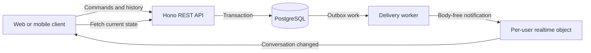
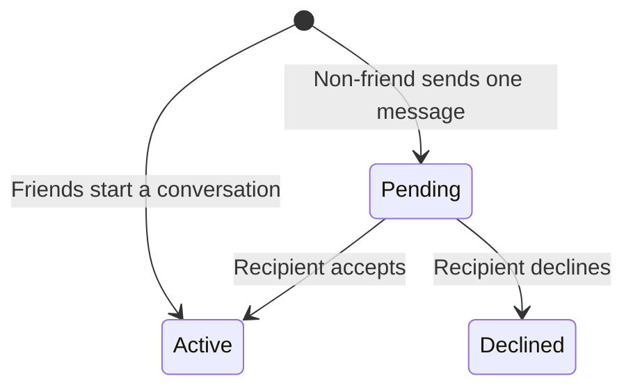
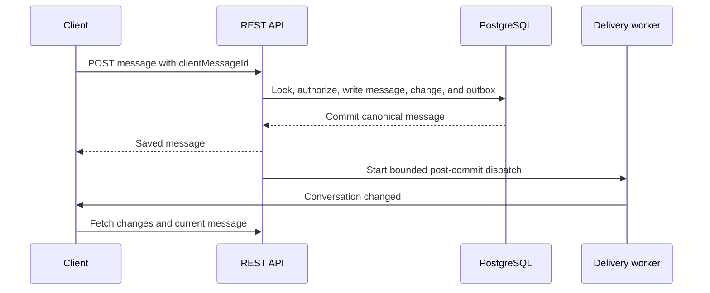
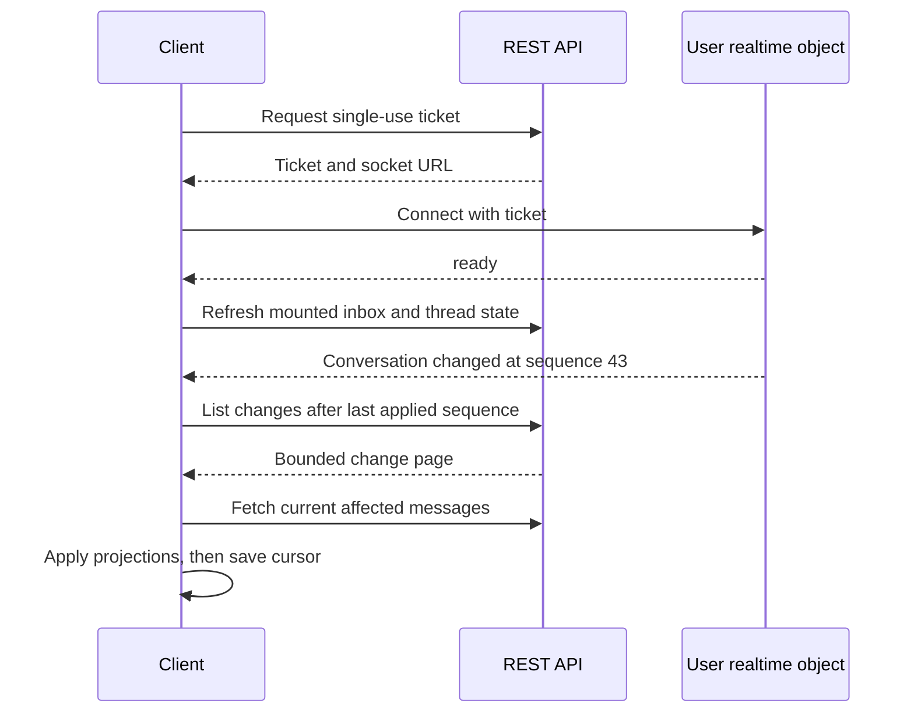

A chat screen has two jobs that are easy to mix up. It must save the message reliably, and it must make the other person's screen notice the change quickly. Dayli gives those jobs to different parts of the system.

PostgreSQL stores conversations, messages, read positions, reactions, and delivery work. The authenticated REST API is the only way a client reads or changes that state. WebSockets carry small notifications that say a conversation changed. They do not carry message text.



This separation means a lost socket frame does not lose a message. A client can reconnect and rebuild its view from durable REST data.

## What the current feature supports

Messaging currently supports one direct conversation for each pair of accounts. Web and Flutter use the same API for:

- an inbox and a separate message-request folder;
- paginated message history and unread counts;
- replies, reactions, edits, and unsending;
- read positions and shared read receipts when policy allows them;
- foreground updates through WebSockets;
- mobile push registration and generic FCM notifications.

Message text is plain text. It must contain something other than whitespace and can contain at most 4,000 Unicode code points. A message may reply to another message in the same conversation.

There are no group conversations, message attachments, typing indicators, presence, browser push notifications, message search, or end-to-end encryption. Image and video uploads exist for posts and avatars, but they are not accepted by messaging. Mobile push provider setup also has release checks that local tests cannot satisfy.


The screenshot uses synthetic local accounts after the recipient accepted the conversation request.

## Direct conversations and message requests

Friends can begin an active conversation. Someone who is not a friend can send one initial message, which creates a pending request for the recipient. The sender cannot add more messages while that request remains pending. Only the recipient can accept or decline it.



An active conversation remains active if the friendship later ends. A declined request does not automatically reopen. If an active friendship later exists, the next authorized direct-message action can activate an earlier pending or declined conversation.

Blocking in either direction prevents new peer-visible actions. That includes sending, accepting a request, editing, reacting, and sharing a new read receipt. Existing authorized history remains readable. A person may still clear their own unread state while blocked, but that private read does not reveal a receipt to the other person.

The API checks these rules in the same database transaction as each write. Page navigation and hidden buttons are useful interface choices, but they are not authorization.

## Saving a message without losing its notification

A send does more than insert one row. The transaction locks the two participants in a stable order, checks account and block state, locks the conversation, allocates its next sequence, writes the message, records a conversation change, and inserts delivery work into the outbox.



The message and its outbox records commit together. If the transaction fails, neither exists. If immediate delivery fails after commit, a scheduled job claims due outbox rows and retries them with leases and capped backoff. Realtime delivery and each push device have separate jobs, so a push failure does not hold up a socket notification.

Delivery is at least once. A worker can publish just before losing its lease, so clients must tolerate duplicate event IDs. The event contains an event ID, conversation ID, and change sequence, never the message body.

Clients supply a `clientMessageId` for send retries. Reusing it with the same request returns the existing message. Reusing it for different text or a different target returns a conflict. This prevents a timeout followed by Retry from creating a second bubble.

## Realtime is a hint, REST is the authority

The client first asks REST for a short-lived, single-use socket ticket. The API binds that ticket to the current session. A browser origin is checked during the upgrade, while a native connection without an Origin still needs a valid ticket.

Cloudflare runs one hibernating Durable Object for each user. Every active tab or device for that user connects to the same object, up to the configured connection limit. The object stores socket coordination metadata, not conversation history. It checks that sessions remain active before publication and closes sockets after session expiry or revocation.

A notification goes to both conversation participants, including the person who made the change. This is intentional. If you send from your phone, another browser tab signed in as you still needs to update.

On `ready`, reconnect, or foreground resume, a client refreshes its active REST state. For each later notification it reads the durable change feed, fetches the current projection of affected messages, applies the page, and only then advances its change cursor. Edits, reactions, and tombstones can affect messages outside the latest history page, so fetching only messages with a higher message sequence would miss them.

There is no periodic fallback poll. Web and Flutter reconnect with capped exponential backoff and jitter. Initial load, manual refresh, foreground resume, reconnect, and socket notifications are the events that cause REST reads. A disconnected user can still send through REST, and the interface offers manual refresh instead of quietly starting a timer.

<details>
<summary>Show the reconnect and catch-up sequence</summary>



</details>

## Unread state and read receipts

Each conversation member has two monotonic positions:

- `lastReadSequence` is the reader's private progress.
- `receiptSequence` is the progress that policy allows the peer to see.

The server clamps a read request to a real conversation position and keeps the larger existing value. Unread counts include non-unsent messages from the other participant after `lastReadSequence`. They do not use `last message sequence minus last read sequence`, because that would count your own messages and unsent tombstones.

Pending and blocked reads can advance private progress without advancing the shared receipt. Web marks an incoming message read only when the page is visible and the message marker is in view. Flutter updates through its conversation controller and the same server rule.

## Replies, reactions, edits, and unsending

Replies store a reference to another message in the same conversation. API responses include a safe current preview. If the parent is unsent, reconciliation clears its text rather than preserving a copied quote.

Each participant can have one reaction on a message. Setting another reaction replaces their current choice. The allowed values are `like`, `love`, `laugh`, `surprised`, `sad`, `angry`, and `thanks`.

Only the sender can edit a message, and the server uses a strict 15 minute window from its creation time. The request includes the expected message version. A stale editor gets a conflict and must fetch the current message rather than overwriting a newer change.

Unsend is not row deletion. It clears the stored body, removes reactions, increments the message version, and keeps a tombstone with stable ordering and sender metadata. It cannot recall text that another person already read or that an operating system already displayed.

There is no endpoint to delete a whole conversation. Account deletion immediately removes sessions, socket tickets, push devices, and pending delivery for that account. Durable participant IDs let surviving conversation history refer to a deleted account without retaining its active profile mapping. That retained message text is still identifying content, not anonymized data.

## Mobile push

New messages create push outbox work for eligible devices belonging to the peer. Edits, reactions, reads, and unsends do not create push alerts. Dispatch rechecks the registration, live session, active participant mapping, account policy, and block state before contacting FCM. It does not currently cancel an already queued generic alert because the message was later read or unsent, so a delayed alert can arrive without exposing message text.

The notification is deliberately generic:

```text
Dayli
New message on Dayli
```

Its data contains only an event ID and conversation ID. A notification tap is treated as a navigation hint. The app must authenticate and authorize a REST fetch before it shows history. Foreground Firebase messages trigger refresh work without showing a second operating-system banner.

Provider tokens are encrypted before storage when the Worker encryption key is configured. A registration belongs to one user, session, and installation. Account switching unregisters the old installation before installing the new account's credentials where possible, while dispatch still rejects stale sessions if client cleanup failed.

The code includes FCM HTTP v1 sending and Flutter Firebase lifecycle adapters. That does not by itself prove Firebase, APNs, signing, or physical-device delivery is configured in an environment. See [Setup and verification](/docs/systems/messaging/setup-and-verification) for that boundary.

## Where the code lives

The API actions are under `apps/api/src/features/messaging`. Delivery adapters are under `apps/api/src/infrastructure/jobs`, `realtime`, and `push`. The PostgreSQL schema is in `packages/db/src/schema/messaging.ts`.

Web state and screens are in `apps/web/features/messaging`. Flutter uses `apps/mobile/lib/messaging` and `apps/mobile/lib/notifications`. The [API reference](/docs/api-reference) lists the messaging REST operations.

[Design history and lessons](/docs/systems/messaging/design-history-and-lessons) explains why the system uses REST plus body-free socket notifications and records which early plans changed. [Setup and verification](/docs/systems/messaging/setup-and-verification) covers local checks, Worker bindings, push configuration, and the evidence that still needs staging or devices.
