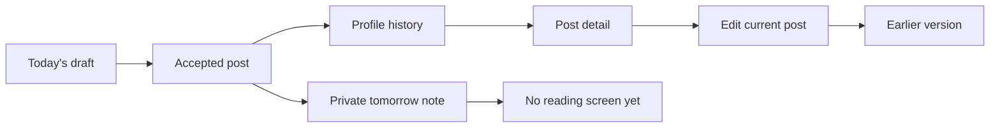

A daily reflection is useful after its posting window closes. Someone may want to revisit what they wrote, see the prompt that shaped it, correct a mistake, or understand which version a friend can read. That makes history more than a list of old posts. It also needs stable prompts, privacy checks, and clear rules for edits and deletion.

Dayli's current history experience is built around profile posts, post detail, and a mood history chart on profiles. It does not yet have calendars, recaps, search across reflections, or a screen for tomorrow notes. Those ideas appear in older project plans, but they are not live features in the checked-in web or mobile apps.

## What one saved day contains

An accepted post stores its Auckland date, the exact prompt ID, reflective answer, optional caption, rating from 1 to 10, audience, acceptance time, and release time. Media links are separate records. An optional tomorrow note is stored in its own table.

Keeping the prompt with the post matters because today's prompt may later change. Prompt rows are immutable. A replacement prompt gets a new version and effective date, while an old post continues to point to the prompt it actually answered.

The rating is saved and returned by profile and detail APIs. Current profile cards focus on the prompt and answer, while post detail shows the rating. Ratings are also aggregated into the profile's [mood history](#mood-history-on-profiles).

Drafts are not part of account history. Flutter keeps one unfinished per-account draft in protected device storage, including its rating, prompt, audience, tomorrow note, retry key, and upload state. A missed draft stays readable on that device but cannot be backdated. The web form keeps unsent work only in React memory, so a reload or navigation loses it. [Daily posts and release timing](/docs/systems/daily-posts-and-release-timing) covers the posting deadline, retries, and these client differences.

## The profile archive

`GET /api/v1/profiles/{username}/posts` returns profile history newest Auckland day first. It uses an opaque `(localDate, id)` cursor, defaults to 20 items, and allows at most 100. The API rechecks visibility before every page and applies it before the page limit.

Who receives which history depends on both the post audience and profile visibility:

| Reader | History returned by the API |
| --- | --- |
| Owner | Every active post, including `solo` posts and today's unreleased post |
| Active friend | Released `friends` posts |
| Other reader of a public profile | Released `friends` posts, including without a session |
| Other reader of a private profile | A generic restricted response with the username and no post data |
| A known reader blocked in either direction | `404`, the same as an unknown or inactive profile |

A public profile does not reveal `solo` or unreleased posts. A private profile does not become readable merely because someone knows the username. The full permission model, including the one-day feed, is in [Friends and feed visibility](/docs/systems/friends-and-feed-visibility).

The web profile route is `/u/{username}`. It renders profile cards that open `/u/{username}/{postId}`. On an owner's archive, cards mark unreleased posts as **Not released yet** and released solo posts as **Only you**. Flutter uses the same paginated API for social profiles and the **my days** tab.

Web and Flutter now use those optional-session reads for public journeys. A signed-out reader can open a public profile, page through released `friends` posts, view public media, and open post detail. A private profile renders a restricted state instead of exposing its details or archive. Both clients re-run the read after session identity changes, so a public response from before sign-in is not reused as an authenticated response.

## Post detail is the full reflection view

`GET /api/v1/posts/{postId}` returns the post, stored prompt, answer, caption, rating, audience, timestamps, media, and edit metadata. The response never includes a tomorrow note. It also returns `likeCount`, `viewerHasLiked`, and `commentCount` from the post interaction projections. The remaining repository guide at `docs/dayli/likes-and-comments.md` explains those interactions. The author can open an active `solo` or unreleased post. Other readers need a released `friends` post that the current visibility policy allows.

Like profile history, detail supports anonymous reads for a released `friends` post on a public profile. An unreadable post and an unknown ID both return `404`. The web uses `/u/{username}/{postId}` and replaces a stale username in the URL with the author's current one. Flutter uses `/posts/{id}`. Both routes can open signed out. Actions such as adding a friend, starting a message, liking, or commenting still require sign-in. The clients retain the intended action across authentication but require another tap before any write.

Both clients fetch detail again when opening it. Flutter also reloads on pull-to-refresh. If a post moved to Trash or access ended, the clients show one unavailable state rather than explaining whether deletion, audience, friendship, or blocking caused it.

Flutter post detail can play an attached voice memo. It starts only after a tap, pauses when the app leaves the foreground, and asks once for a fresh URL if the first one has expired. Web post detail does not play voice memos yet.

## Likes and comments use the friend boundary

The interaction API is wired into the normal runtime. A signed-in owner or active friend with a username can like or unlike a readable post, list its likers, and read or write comments. Comments allow one level of replies and up to 1,000 Unicode characters. A comment author may edit or delete their comment, and the post author may delete comments on their post.

Interactions deliberately use the friend preview policy rather than the wider public detail policy. A stranger may read a released post on a public profile, but cannot see its likers or comments and cannot add either. Moving a post to Trash, changing its audience, ending the friendship, or blocking removes interaction access with the post. Counts leave out deleted comments and blocked people.

Web and Flutter post detail show the like button, like count, likers, and the comment thread with replies, edits, and deletes. Feed and profile cards show like and comment counts, and the profile stats include **Loved**: likes on the owner's posts that are not in Trash. A signed-out reader instead sees **like** and **comment** buttons that lead to sign-in. After returning, a comment intent focuses the comment box and a like intent only reopens the post: the action is never submitted on the reader's behalf. The repository guide at `docs/dayli/likes-and-comments.md` has the full rules.

## Mood history on profiles

`GET /api/v1/profiles/{username}/mood?range=30d|90d|1y` returns one person's daily ratings for the range, ending today in Auckland, with a summary of that range and the one before it. It reaches the same people as the posts, but no further: the owner sees every post including `solo` ones, an active friend sees released `friends` posts, and anyone else gets `403`, even on a public profile. Days with a post the reader cannot see are returned as `hiddenDays`, so they are neither rated nor counted as missed. Days before the account's first Auckland day are not tracked.

Web and Flutter show it as a **Mood** card on the profile with **30 days**, **90 days**, and **Year**. The line joins consecutive days only, so a missed day leaves a gap rather than an invented value. The card describes what was posted and does not label moods. The repository guide at `docs/dayli/mood-history.md` has the response fields and summary rules.

## On This Day and future-self notes are API-only

Two reflection features have working, owner-only APIs and no client screens yet:

- `GET /api/v1/me/memories/on-this-day` returns the caller's own released posts from today's Auckland month and day in earlier years, newest first. The server decides the date, and a 29 February post appears only on later leap days. See `docs/dayli/on-this-day.md`.
- `/api/v1/future-self-notes` lets the owner create, list, edit, and delete a note to read on a chosen Auckland date. The text is never returned before that date, even to its author: the read returns `403` with `NOTE_NOT_YET_AVAILABLE`. A scheduled job marks notes delivered on their date but sends no push notification. See `docs/dayli/future-self-notes.md`.

Neither feature appears in the web or Flutter apps yet. They should not be described as available to users until those screens exist.

## Editing without erasing the earlier version

Authors can edit the reflective answer, optional caption, rating, and audience before or after release. They cannot change the Auckland date, prompt, media, or tomorrow note. Web shows **Edit** on the author's detail page, and Flutter puts it in the post menu.

`PATCH /api/v1/posts/{postId}` receives all four editable fields plus `expectedRevisionCount`. The repository locks the post row and compares that count before writing:

- Sending values that already match is a no-op. It does not create another revision.
- A stale count returns `409`, so one device cannot silently overwrite an edit saved elsewhere.
- A real change inserts the previous post values into `post_revisions` and updates the current post in one transaction.

The clients keep the author's form values after an offline, failed, or conflicting save. Their conflict action reloads the latest post without silently replacing those unsaved changes.

`GET /api/v1/posts/{postId}/revisions` returns earlier versions newest first. It requires authentication. The author sees every revision. Another signed-in reader sees only revisions whose earlier audience was `friends`. Text written while a version was `solo` does not become visible just because the current post later changes to `friends`.

Revision access follows the current post. If the current post becomes unreadable because of its audience, an ended friendship, a block, account state, or Trash, its earlier versions also become unreadable. The `edited` flag and `revisionCount` include only versions the current reader may see, so a hidden solo edit does not reveal itself through a counter.

Web opens earlier versions inline from **Edited · see earlier versions**. Flutter opens a separate screen. Both show the earlier answer, caption, rating, audience where the viewer is the author, and replacement time. Neither client presents revision media. Revision records retain attachment metadata for history and export review, not a new grant to download old bytes.

## Tomorrow notes are stored, but not readable in the app

A note to tomorrow is private to its author and stored outside both the post and revision projections. Its `availableOn` value is the following Auckland date. The permission helper requires the note's author and a current Auckland date on or after that value. Trashing the parent post also removes the note from normal visibility.

That data rule is implemented, but the product flow stops there. There is no route that lists or returns tomorrow-note text to a client, and there is no web or Flutter reading screen. Post creation returns only the availability date. Feed, archive, detail, revision, and media responses never include the note.

This distinction is important: Dayli safely stores tomorrow notes for a future reading experience, but it does not currently deliver that experience.

## Deletion and Trash are present but switched off

The schema, restricted database procedures, API routes, cleanup dispatcher, and client controls for post Trash exist. The intended lifecycle is:

1. Moving a post to Trash hides it immediately from archive, detail, revisions, media, counts, and streak calculations.
2. The owner may restore it for 168 hours if a replacement post does not occupy that Auckland date.
3. It becomes eligible for physical cleanup 336 hours after deletion.

A post in Trash no longer occupies the active one-post-per-day index, so its author may post a replacement while that day is still open. Restoring the older post then conflicts rather than replacing the newer one.

This lifecycle is not generally active. `GET /api/v1/posts/trash`, `POST /api/v1/posts/{postId}/trash`, and `POST /api/v1/posts/{postId}/restore` are registered, but they return `503` without an explicitly enabled repository. `createAppForEnv` does not currently wire that dependency. The destructive cleanup mode is also disabled by default.

Web and Flutter nevertheless show **Delete** on an author's post detail and call the Trash route. With the current runtime wiring, that action reports a failure rather than deleting the post. There is no current Trash list or restore screen in either client. The interface is ahead of activation here, so documentation should not promise working deletion or seven-day self-service restore.

## Export is not the history screen

The checked-in export work has owner-scoped projections for active and still-restorable posts, revisions, private tomorrow notes, approved profile fields, and other reviewed account data. It also has a versioned ZIP builder and authenticated download checks.

Normal API execution and both clients remain disabled for exports. Web passes `enabled={false}` to its export panel, Flutter sets `nativeExportEnabled` to `false`, and the server-wide `exportExecutionEnabled` constant is also `false`.

There is one narrower exception for staging proof. If the reviewed staging variables, private R2 configuration, and separate `EXPORT_WORKER_HYPERDRIVE` binding are all present, the API admits one named synthetic owner for a time-bounded build. Scheduled cleanup remains enabled after the build window so delayed work can finish and an operator can review it at the configured checkpoint. This fence is evidence for the staged export machinery, not a public self-service release or production availability.

An export is a private account archive with a per-source selection cutoff, not an atomic snapshot and not a replacement for profile history. It does not make tomorrow notes visible to friends or expose received private content.

## Current limits

The implemented reflection and history experience currently includes:

- paginated profile history;
- full post detail with the stored prompt and rating;
- owner editing with conflict detection;
- permission-filtered revision history;
- signed-out web and Flutter journeys for released posts on public profiles;
- owner-and-friend likes, comments, and one-level replies in both clients;
- mood history for the owner and active friends;
- owner-only On This Day and future-self note APIs, without client screens.

It does not currently include reflection search, calendar browsing, recaps, a tomorrow-note reader, On This Day or future-self note screens, an enabled Trash and restore journey, or an enabled self-service export. Streaks and post counts exist on profiles, but they are not a reflection analytics system.

## Code and verification

Post history, detail, editing, revisions, mood history, On This Day, and Trash routes are under `apps/api/src/features/posts`. Likes and comments are under `apps/api/src/features/interactions`, and future-self notes under `apps/api/src/features/future-self-notes`. Shared read policy is in `apps/api/src/features/permissions/drizzle.ts`, and the post, revision, and tomorrow-note tables are in `packages/db/src/schema/index.ts`. Export classification and sources are under `packages/db/src/export` and `apps/api/src/features/data-export`.

Web history code is under `apps/web/features/posts` and the `/u` routes. Flutter uses `apps/mobile/lib/profile`, `friends`, `posts`, and `drafts`.

Route and PostgreSQL integration tests cover archive paging, public and private profiles, stored prompts, ratings, edit conflicts, immutable revisions, solo-era privacy, block and friendship changes, interactions, and Trash concealment. Web and Flutter tests cover public route transitions, profile paging, detail refresh, media reads, edits, revision lists, and deletion failure states. These tests establish checked-in behavior against local fixtures. Separate emulator and browser records cover synthetic public and export journeys, but they do not activate Trash, exports for ordinary accounts, or tomorrow-note reading in a deployed environment.
