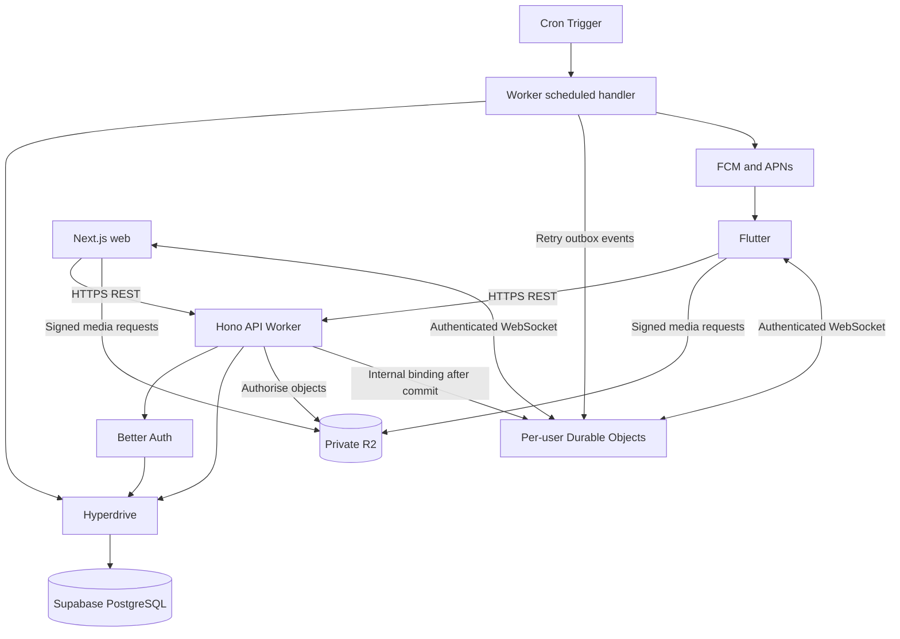

# Architecture

## Shared backend

The phone and browser call the same Hono API. They do not call each other. PostgreSQL owns content and permissions; R2 holds media; Durable Objects coordinate connected devices.



Hono is the API framework, Workers is its runtime, and Wrangler is the development/deployment tool. This is a separate API deployment, not Next.js Route Handlers and not an always-running VM. The backend can read posts and messages under the agreed [privacy model](security.md).

## Monorepo

```text
apps/
  web/                  # Next.js UI
  mobile/               # Flutter, including ios/ and android/
  api/                  # Hono routes, scheduled handler, Durable Object class
packages/
  domain/               # Reusable TypeScript services
  db/                   # Drizzle schema, migrations, test factories
  contracts/            # Zod/OpenAPI and generated TypeScript models
infra/                  # Environment setup and operational runbooks
docs/dayli/             # Proposal and decisions
```

Use pnpm workspaces for TypeScript and Dart tooling for Flutter. Generate the Dart client from OpenAPI; Flutter cannot import TypeScript types. Share a repository, not a deployment schedule. Changes to shared contracts/services trigger tests for all affected consumers.

Routes authenticate and validate. Domain services enforce rules. Repositories perform SQL. Services must not depend on Hono request objects, `NextRequest`, or `TRPCError`. Native camera, weather, clock, and notification access stay behind testable Flutter interfaces.

## API and data model

Use `/api/v1`, opaque IDs, UTC ISO timestamps, Auckland date-only values, bounded cursor pagination, and stable error codes. Preserve compatibility with older mobile versions.

| API area | Responsibility |
| --- | --- |
| Day and posts | Prompt, server date/deadline, submission, revisions, release, feed, and owner archive. |
| Uploads and media | Owned upload reservations, validation/completion, private downloads. |
| Friends, blocks, comments, likes | Existing social workflows with central visibility checks. |
| Conversations and messages | Participant checks, message requests, history, sending, read positions. |
| Realtime | Issue short-lived connection tickets and authenticate WebSocket upgrades. |
| Mood history and recaps | Owner-scoped, bounded server-side aggregates. |
| Sharing | Expiring invitations and explicit single-post grants. |
| Future notes and notifications | Owner notes, due times, preferences, push tokens. |

Keep the existing relational schema and server-readable content fields. Add post audience, `release_at TIMESTAMPTZ`, revisions, structured context, explicit grants, upload reservations, message idempotency, invitations, future notes, and outbox/jobs. Use `DATE` for the posting day and retain `UNIQUE(author_id, local_date)` and the rating check.

## Posting and release

1. Fetch the server's current Auckland day and deadline. Device clocks affect only the countdown display.
2. Capture media, preview optional context, and save a locally protected draft. Compress photos and create thumbnails before upload.
3. Reserve private R2 objects through the API and upload directly over HTTPS. Validate ownership, completion, actual media type, size, and safe processing limits before marking media ready.
4. Submit with an idempotency key. In a transaction, check server time, audience, ready uploads, and the daily constraint, then save the post and outbox metadata.
5. Retry lost responses with the same key. If the server did not accept the post before midnight, retain the draft and ask the user to adapt it for the new day. Never silently backdate it.

Use revisions to reject conflicting edits across devices. Clean up abandoned reservations and objects with retried jobs. A presigned PUT is not a complete quota or content-validation system.

Compute the next Auckland midnight with calendar-aware timezone logic. Do not add 24 hours or use a fixed UTC offset. Owners can read early; other viewers need both `now >= release_at` and an allowed audience/grant, with blocks applied. Enforce this on every list, detail, media, preview, comment, and sharing route. No bulk midnight update is needed.

## WebSockets and Durable Objects

Each user has one logical Durable Object, identified by the backend from their authenticated ID. It connects their phone and browser tabs. This is not one rented server per account.

1. A client obtains a short-lived, single-use ticket through authenticated REST. The upgrade handler atomically consumes it, binds it to the user/session, and routes the connection to that user's object. Validate browser origins and redact tickets from logs.
2. The client sends messages through REST, not directly to the object. The backend checks membership, blocks, request state, limits, and idempotency. Lock pending-request state so concurrent sends cannot bypass the one-message limit.
3. A transaction saves the message, conversation activity, and per-recipient outbox events. After commit, attempt immediate bounded delivery through internal Durable Object bindings.
4. Each object broadcasts only event ID, change type, and relevant record IDs. Clients fetch authorised content through REST and merge by ID.
5. Failed publication remains in the outbox for retry. A disconnected client fetches missed history on reconnect/resume even if no event arrives. PostgreSQL remains the source of truth.

Use the WebSocket Hibernation API. Idle objects can sleep while connections stay open. In-memory fields do not survive hibernation; persist required connection metadata with attachments and durable state in storage. Attachments do not survive a lost socket and are not message history.

Only internal backend calls publish application events. Limit sockets, frames, and reconnect attempts. Implement session expiry and revocation across active connections. Use attachment expiry checks plus a persisted expiry schedule/alarm when needed; do not rely solely on a timer lost during hibernation. Logout should close affected sockets, with expiry as a backstop.

Read receipts are monotonic authorised updates. A persisted message is not proof of delivery or reading. On realtime failure, use bounded foreground polling with backoff. Suspended apps receive generic FCM/APNs notifications, not an assumed permanent socket.

## Jobs, reflection, and sharing

A Cron Trigger calls the API Worker's `scheduled` handler directly. No public cron HTTP endpoint or separate signing protocol is needed. Claim bounded PostgreSQL jobs with leases and `FOR UPDATE SKIP LOCKED`. Retry with stable dedupe keys; catch up missed work and discard expired nudges. Push may arrive late or more than once. Respect quiet hours and invalid-token cleanup.

Keep SQL mood queries and extend them for calendar/yearly views. Cache only under deliberate freshness and owner-access rules. Context collection uses permission-based weather/music providers and explicit audio capture. Provider failures must not block posting. Do not send content to external AI services without a separate privacy decision.

Share links require signup. The proposed default is an expiring, single-use invitation whose first authenticated claimant gets one post after release. Disclose forwarding risk; recipient-bound invitations offer stronger control. Normal friendship and archive access remain separate.

Future notes are owner-only scheduled reminders, not cryptographic time capsules. Revocation blocks future API access, but previously downloaded content and unexpired signed URLs cannot be recalled.

See [Scalability](scalability.md) for capacity/cost decisions and [Security](security.md) for the permission and session controls.
