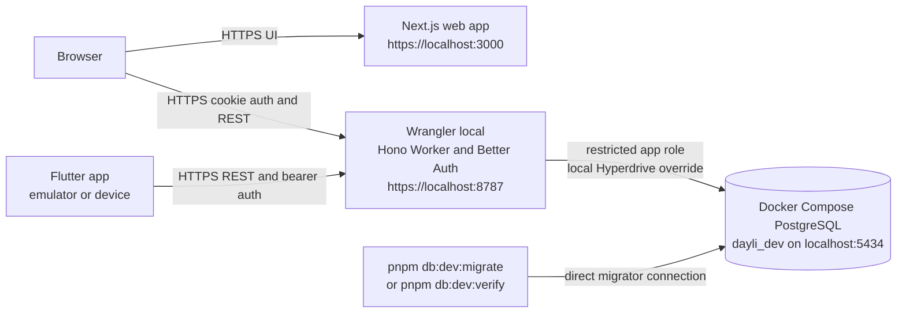
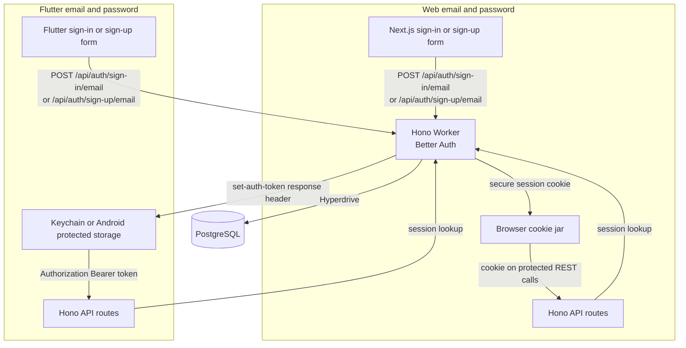

# Architecture

This document describes code that exists in this repository. The supported runtime is local development. Staging and production are not deployed.

## Local runtime

`pnpm local:auth:setup` prepares ignored local settings and a localhost certificate. `pnpm db:dev:up` starts the persistent PostgreSQL development database. `pnpm dev:api:https` starts Wrangler locally on `https://localhost:8787`, and `pnpm dev:web:https` starts Next.js on `https://localhost:3000`.

The Worker receives only the restricted `app` database connection through its local Hyperdrive override. `pnpm db:dev:migrate` and `pnpm db:dev:verify` connect directly as `migrator`; they do not pass through the Worker. This is the local migration boundary.



The API entry point builds a Hono application. With valid local Better Auth and Hyperdrive settings, it mounts Better Auth on `/api/auth` and database-backed routes on `/api/v1`. PostgreSQL holds Better Auth records, daily prompts, posts, post idempotency keys, relationship records, and media reservations.

The API currently registers routes for health and API documentation, Better Auth, the current posting day, post creation, relationships, and media reservations. A route returns an unavailable response when its required runtime configuration is absent.

## Email and password authentication

Email and password authentication is enabled in the Better Auth configuration. The web app uses Better Auth's React client with credentialed requests, so the browser keeps the secure session cookie for the API origin. The Flutter app has its own native path in `lib/auth/native_session.dart`: it exchanges email and password with the same Better Auth routes, saves the returned `set-auth-token` in platform protected storage, then sends it as a bearer token.

The Flutter email and password path is implemented in source and covered by Flutter tests, but it has not been manually exercised on a device. The environment guide also records that the iOS Simulator authentication flow has not been executed.



## Posts, drafts, and media

`GET /api/v1/posting-days/current` returns the server-owned Auckland posting day, deadline, prompt, and whether the authenticated author has posted. Both web and Flutter use this route.

The web post form calls `POST /api/v1/posts` with an idempotency key. It submits the prompt response, rating, optional caption, and the fixed `friends` audience. The form requires a selected photo or video before it enables the rest of the form, but it does not send that file or a media reference. The selected files stay in the browser. The API accepts one post per author and Auckland day and stores idempotency data for accepted requests.

Flutter saves each author's draft and selected media references in protected local storage. It reads the posting day through the generated Dart client, but `main.dart` supplies `UnavailablePostSubmitter`. Flutter therefore does not send `POST /api/v1/posts`; a submission reports unavailable and retains the draft.

The API has `POST /api/v1/media-reservations` and `GET /api/v1/media-reservations/{id}`. When Better Auth and all R2 configuration values are present, the create route records an owner-specific reservation and returns a presigned single-object PUT URL. Neither application client calls the reservation endpoint or uploads reserved media.

## Repository components

```text
apps/api/       Hono Worker, Better Auth, API routes, and local Wrangler configuration
apps/web/       Next.js web client
apps/mobile/    Flutter client, protected drafts, and native bearer sessions
packages/db/    Drizzle schema, migrations, migration checks, and local database Compose files
scripts/        Local HTTPS authentication and development database helpers
```
