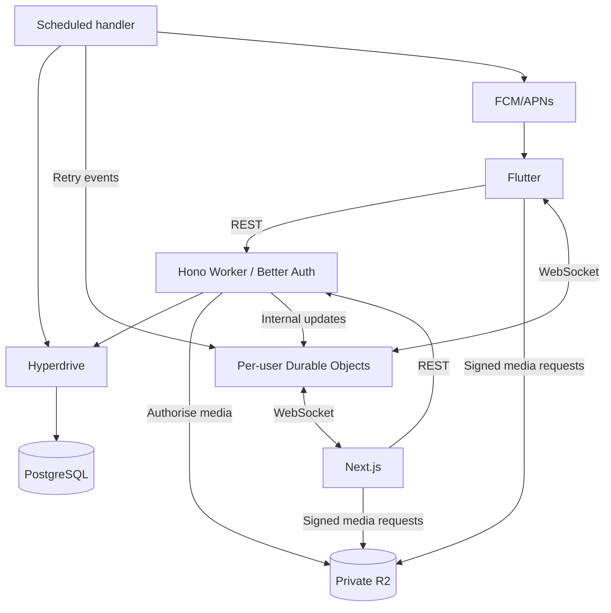

# Architecture

## Components

This is the target architecture. The current Worker implements Better Auth, posting-day reads, daily-post creation, relationships, and media-reservation routes. The web app calls the posting API. The Flutter composer retains drafts and reads posting days, but its `UnavailablePostSubmitter` does not send `POST /api/v1/posts`. Neither client uploads reserved media yet. Staging and production are not deployed.



## Monorepo

```text
apps/web/              Next.js
apps/mobile/           Flutter
apps/api/              Hono, scheduled handler, Durable Objects
packages/domain/       Reusable backend services
packages/db/           Drizzle schema and migrations
packages/contracts/    Zod/OpenAPI and generated TS models
docs/dayli/            These guides
```

Use pnpm for TypeScript and Dart tooling for Flutter. Generate the Dart client from OpenAPI. Web and API deploy independently.

Routes authenticate and validate; services enforce rules; repositories execute SQL. The shared `/api/v1` contract is the intended boundary for posts, relationships, messages, history, sharing, and notifications. Use stable errors, UTC timestamps, Auckland dates, revisions, and bounded cursor pagination.

## Posting

1. Fetch the server's day/deadline. Capture media and save a locally protected draft.
2. Reserve owned R2 objects, upload directly, and validate actual type, size, and completion before readiness.
3. Submit with an idempotency key. Transactionally check the deadline, audience, media, and unique author/day constraint.
4. Retry lost responses with the same key. If acceptance misses midnight, retain the draft rather than backdating it.

Store a timezone-correct `release_at`. Owners can read early. Friends need release, an active friendship, and no block; friendship grants access to earlier released friends posts. Public-link readers need release and an active opaque share token from a public account. Apply this to media and every alternate route. No midnight bulk update is needed.

## Messaging and sockets

One logical Durable Object connects each user's active devices. It is not their message database.

Send messages through REST. Check participants, blocks, and request state; lock pending-request checks against concurrent sends. Save the message and outbox events in one PostgreSQL transaction. After commit, notify both users' objects through internal bindings.

Objects send small record-ID events. Clients fetch authorised content and deduplicate IDs. Failed publication retries from the outbox; reconnect always fetches missed history. Read receipts are monotonic and authorised.

Authenticate upgrades with short-lived, single-use tickets bound to verified sessions. Validate browser origins. Clients cannot select another user's object or publish application events. Enforce expiry/revocation after hibernation too. Use attachments for connection metadata, not history; ordinary memory does not survive hibernation.

## Supporting records and jobs

Keep existing content tables. Add audiences/releases, immutable revisions, private upload reservations, revocable public share tokens, message idempotency, socket tickets, future notes, and outbox/jobs.

A Cron Trigger invokes the Worker's scheduled handler directly. Claim bounded leased jobs, retry safely, and discard expired reminders. Push handles suspended apps. SQL calculates owner-scoped mood history and recaps. Public share links are unlisted bearer links, remain valid until invalidated, and can be forwarded.

[Security rules](security.md) · [Scaling and failure handling](scalability.md) · [Implementation details](implementation-reference.md)
