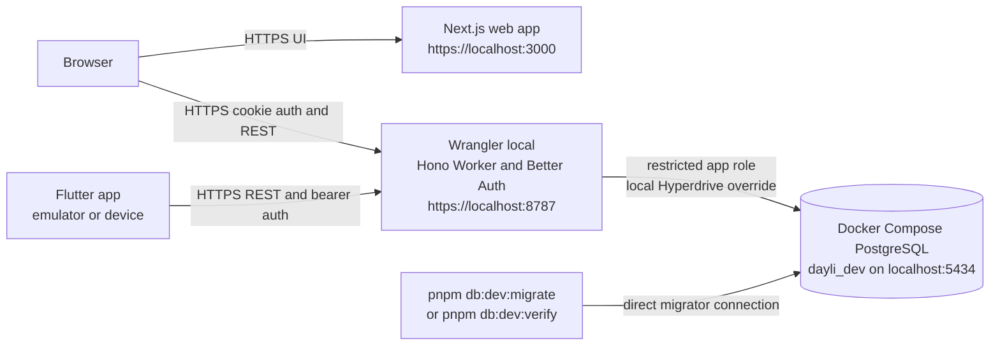
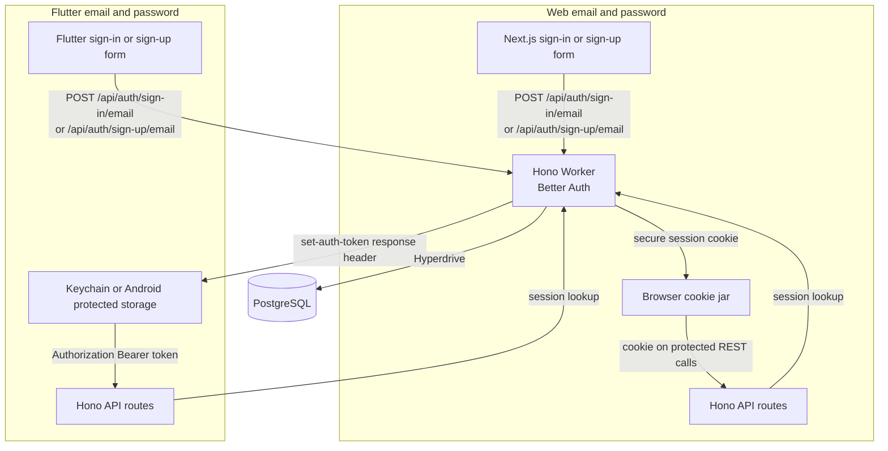

# Architecture

The current-runtime sections describe checked-in code. Local development is supported; separate environment records document the limited staging proofs. Production is not deployed. The proposed messaging section is a plan, not implemented infrastructure.

The proposed organization and engineering conventions are documented separately in [Backend architecture](../backend-architecture.md). The [refactor plan](../implementation/backend-refactor.md) changes structure without changing existing behavior.

## Local runtime

`pnpm local:auth:setup` prepares ignored local settings and a localhost certificate. `pnpm db:dev:up` starts the persistent PostgreSQL development database. `pnpm dev:api:https` starts Wrangler locally on `https://localhost:8787`, and `pnpm dev:web:https` starts Next.js on `https://localhost:3000`.

The Worker receives only the restricted `app` database connection through its local Hyperdrive override. `pnpm db:dev:migrate` and `pnpm db:dev:verify` connect directly as `migrator`; they do not pass through the Worker. This is the local migration boundary.



The API entry point builds a Hono application. With valid local Better Auth and Hyperdrive settings, it mounts Better Auth on `/api/auth` and database-backed routes on `/api/v1`. PostgreSQL holds Better Auth records, daily prompts, posts, post idempotency keys, relationship records, and media reservations.

The API currently registers routes for health and API documentation, Better Auth, the current posting day, post creation, the friends feed, post detail, profile posts, On This Day memories, relationships, and media reservations. A route returns an unavailable response when its required runtime configuration is absent.

## Email and password authentication

Email and password authentication is enabled in the Better Auth configuration. The web app uses Better Auth's React client with credentialed requests, so the browser keeps the secure session cookie for the API origin. The Flutter app has its own native path in `lib/auth/native_session.dart`: it exchanges email and password with the same Better Auth routes, saves the returned `set-auth-token` in platform protected storage, then sends it as a bearer token.

The Flutter email and password path is implemented in source and covered by Flutter tests, but it has not been manually exercised on a device. The environment guide also records that the iOS Simulator authentication flow has not been executed.



## Posts, drafts, and media

`GET /api/v1/posting-days/current` returns the server-owned Auckland posting day, deadline, prompt, and whether the authenticated author has posted. Both web and Flutter use this route.

The web post form calls `POST /api/v1/posts` with an idempotency key. It submits the prompt response, rating, optional caption, optional tomorrow note, and the `solo` or `friends` audience the author chose. Media is optional and is not sent. The selected files stay in the browser. The API accepts one post per author and Auckland day and stores idempotency data for accepted requests.

Flutter saves each author's draft in protected local storage, including each attachment's compressed copy, reservation ID, and upload status. It compresses and uploads attachments one at a time while the composer is open, straight to R2, and resumes an interrupted upload on the next open. It reads the posting day and sends `POST /api/v1/posts` through the generated Dart client with the draft's stored idempotency key and the validated uploads' reservation IDs, which the API links to the post as `post_media` rows. The draft is removed only after the server accepts the post. Attached media can't be viewed until downloads are authorised (#24).

`GET /api/v1/feed` returns yesterday's `friends` posts from active, unblocked friends, using the shared post visibility predicate. The web home page and the Flutter home screen page through it. See [Friends feed](friends-feed.md). `GET /api/v1/posts/{postId}` returns one post through the same predicate and conceals unreadable posts as 404. See [Post detail](post-detail.md). Both include the post's media with 5-minute private download URLs, signed only after the predicate allows the post; `GET /api/v1/posts/{postId}/media/{mediaId}` issues a fresh one. See [Downloads](media-reservations.md#downloads). `GET /api/v1/profiles/{username}/posts` lists one profile's posts through the same predicate: everything for the owner, released `friends` posts for an active friend. See [Profile archive](profile-archive.md). `GET /api/v1/me/memories/on-this-day` returns the caller's own posts from today's Auckland month and day in earlier years. See [On This Day](on-this-day.md). `GET /api/v1/profiles/{username}`, `PATCH /api/v1/profile`, and `PUT /api/v1/profile/username` read and edit profile details. See [Profiles](profiles.md).

The API has `POST /api/v1/media-reservations`, `GET /api/v1/media-reservations/{id}`, and `POST /api/v1/media-reservations/{id}/complete`. When Better Auth and all R2 configuration values are present, the create route records an owner-specific reservation and returns a presigned single-object PUT URL, and completion checks the uploaded object's size, format, and video duration. Flutter uses all three; the web client doesn't upload media yet. See [Media reservations](media-reservations.md).

## Proposed messaging architecture

Messaging is not implemented yet. Both clients currently show placeholders. The [implementation handoff](../implementation/messaging-implementation-handoff.md) specifies the file tree, Hono API, database constraints, tests, and ticket-sized work.

```text
Web / Flutter -> Hono REST -> PostgreSQL message + change + outbox transaction
                                  |
                             after commit
                                  |
                         immediate outbox dispatch
                           /                  \
             per-user Durable Object        FCM -> Android / APNs -> iOS
                       |
             hibernating WebSocket
                       |
             client fetches authorized REST state
```

Use the existing `apps/api` Worker for Hono routes, the exported Durable Object class, and scheduled outbox repair. No separate Cloudflare workspace package or realtime deployment is planned. Add bindings and Durable Object migrations to API Wrangler configuration; add PostgreSQL migrations under `packages/db/migrations`.

WebSockets deliver small notifications, not message bodies. REST handles commands, history, and recovery. Immediate dispatch supplies healthy live updates; scheduled retries recover failures. Clients reconcile after initial load, socket events, reconnect, foreground resume, or manual refresh. Do not add periodic polling. Mobile push requires separately configured FCM/APNs; browser push is deferred.

Text messaging does not depend on R2. Attachments remain blocked on its owner, and groups remain blocked on policy. Details and unconfirmed defaults are explicit in the handoff.

## Repository components

```text
apps/api/       Hono Worker, Better Auth, API routes, and local Wrangler configuration
apps/web/       Next.js web client
apps/mobile/    Flutter client, protected drafts, and native bearer sessions
packages/db/    Drizzle schema, migrations, migration checks, and local database Compose files
scripts/        Local HTTPS authentication and development database helpers
```
