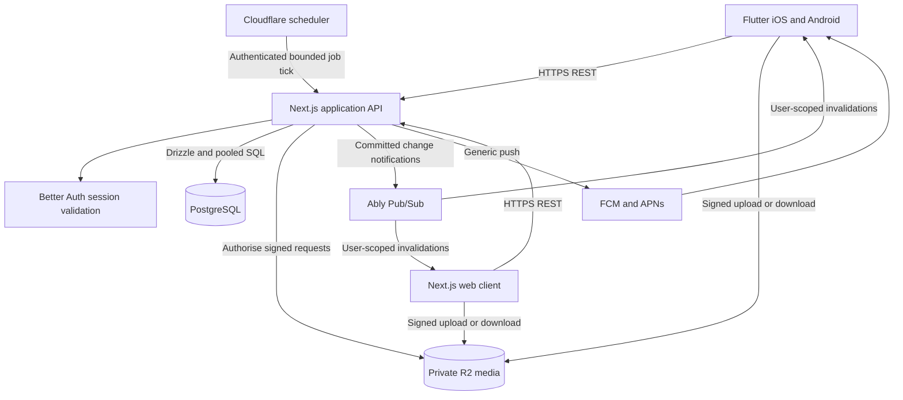

# Architecture

## How the two apps interact

Flutter and the Next.js web client call the same backend. They do not call each other. A phone upload appears on the web because both read the same PostgreSQL records and private media objects.



Next.js Route Handlers provide the shared public API entry point. A separate billed API gateway or Node framework is unnecessary initially. The backend can read posts and messages. HTTPS protects connections and configured storage services provide encryption at rest. Neither protection is end-to-end encryption.

Private API responses use `Cache-Control: no-store`. Never place user-specific content in shared Next.js/CDN caches. Keep static assets cacheable. Short-lived signed media URLs are bearer credentials and must not appear in logs or public previews.

## Target repository layout

```text
apps/
  web/                  # Existing Next.js UI and API host
  mobile/               # Flutter app, including ios/ and android/
packages/
  domain/               # Transport-independent TypeScript services
  db/                   # Drizzle schema, migrations, test factories
  contracts/            # Zod DTOs, OpenAPI, generated TS models
infra/
  scheduler/            # Cron Worker configuration
  local/                # Local dependency configuration
docs/dayli/             # Proposal and decisions
```

This is a target, not a prerequisite to a working flow. Import useful code first. Extract services as new REST adapters need them. In Flutter, organise by composer, feed, journal, messages, and settings. Widgets use Riverpod controllers, which call repositories backed by HTTP, local storage, or native capability adapters.

Keep camera, weather, clock, notifications, and battery access behind interfaces. Test widgets without real network or sensor dependencies.

## API contract

Use `/api/v1`, opaque IDs, JSON-safe types, UTC ISO timestamps, and date-only Auckland posting dates. Generate both client models from OpenAPI. Do not expose database rows directly or let a generated client replace runtime validation.

| Endpoint family | Responsibility |
| --- | --- |
| `GET /day` | Server time, Auckland date, prompt, deadline, release instant. |
| `POST /uploads`, `POST /uploads/{id}/complete` | Reserve uploads, check ownership and completion, validate media lifecycle. |
| `/posts` and `/posts/{id}` | Create, view, edit, and delete with audience, time, ownership, revision, and idempotency checks. |
| `GET /feed?date=...&cursor=...` | Released friends' posts, bounded and paginated. Default to yesterday, matching the existing feed. |
| `/journal`, `/mood-history`, `/recaps` | Owner history and server-side aggregates for date ranges. |
| `/posts/{id}/media/{mediaId}` | Check access and release before issuing a short-lived download. |
| `/friends`, `/friend-requests`, `/blocks` | Existing relationship workflows and new blocking policy. |
| `/conversations`, `/conversations/{id}/messages`, `/conversations/{id}/read` | Existing message history, sending, acceptance, and read state through REST. |
| `POST /realtime/token` | Issue a subscribe-only token for the authenticated user's channel. |
| `/share-invitations`, `/share-claims` | Signup-gated grants for one selected post. |
| `/future-notes`, `/notification-preferences`, `/push-tokens` | Notes, due dates, notification settings, and device registration. |
| `/posts/{id}/comments`, `/posts/{id}/likes` | Existing interaction workflows using the same visibility policy. |

Adapters authenticate and parse requests. Domain services enforce permissions and invariants. Repositories execute SQL. Replace `TRPCError` in reusable services with domain errors, mapped by each HTTP/tRPC adapter.

Return stable errors with `code`, `message`, `requestId`, and optional field errors. Use distinct unauthenticated, forbidden, conflict, validation, and rate-limited responses. Bound page sizes, initially 20 feed entries and 50 messages. Use stable cursors, not increasingly expensive offsets.

## Database changes

Keep Better Auth tables, users, friendships, requests, prompts, posts, comments, likes, conversations, messages, and read state. Retain plaintext application columns such as `day_rating` and `messages.body` within the access-controlled database. The underlying storage is encrypted at rest by the configured provider.

Add or adapt:

- Posts with `local_date DATE`, `release_at TIMESTAMPTZ`, audience, revision, and optional structured weather/music context. Keep `UNIQUE(author_id, local_date)` and the rating check.
- Post-level grants for explicit selected-post access. Profile visibility never grants journal access by itself.
- Media reservations with owner, opaque object key, claimed/verified MIME type, size, status, and expiry. Ready media belongs to one authorised post or draft workflow.
- Message client IDs or idempotency keys unique per sender, bounded bodies, and conversation ordering suitable for cursor retrieval.
- Share invitations with a hashed random token, selected post, expiry, use limit, revocation, and claim records.
- Future notes with owner, body, due instant, and delivery state.
- Push tokens, notification preferences, security session metadata, and durable outbox/jobs with dedupe keys, attempts, leases, and due times.

Index posts by author/date and release time, grants by recipient/post, messages by conversation/time/ID, friendships in both lookup directions, and jobs by state/due time. Use transactions and database constraints for races rather than read-then-write checks alone.

Disable direct public Data API access to application tables or configure and verify strict RLS where exposure is required. A privileged Drizzle connection may bypass RLS, so domain authorisation is still mandatory. No database connection string or service secret belongs in Flutter or browser bundles.

## Posting a day

1. Fetch `/day`. Use server time for eligibility. Device time only drives a display countdown.
2. Capture media and optional context. Show a preview. Persist the draft locally with device-at-rest protection; an unsynced draft cannot be recovered after device loss.
3. Compress the image and create a thumbnail locally for efficient upload. Reserve bounded private objects through the API, then upload over HTTPS directly to R2.
4. Complete the reservation. The backend verifies owner, object path, size, actual supported media type, and safe decode limits. A signed PUT alone does not enforce the full quota or content policy. Uploaded objects remain private and pending until validation succeeds.
5. Submit with an idempotency key. In one transaction, check the server's Auckland day/deadline, media readiness, audience, and input, then insert the post and event metadata.
6. Report success only after server acceptance. Retry a lost response with the same key. Concurrent distinct submissions hit the unique author/date constraint.
7. If the deadline passes before acceptance, preserve the draft and ask the user to adapt it for the new day. Do not backdate it automatically.

Use `If-Match` or a revision field to reject conflicting edits from phone and browser. Delete unclaimed uploads through an idempotent cleanup job. Server-side thumbnail generation or media scanning can be added to a bounded worker without changing the privacy model.

## Midnight and access

Compute the next Auckland midnight using a timezone-aware calendar library. Store its UTC instant. Never add a fixed 24 hours or assume a fixed NZ UTC offset.

An owner may read their own post before release. Other viewers require `now >= release_at` and either the permitted friendship audience or an active explicit grant, with blocks applied. Solo posts are owner-only unless their author explicitly shares that post.

Enforce this same policy for direct posts, profile listings, comments, likes, media, share previews, and notification content. There is no bulk midnight update required for visibility. Scheduler failure must not prevent the feed from unlocking.

Removing a friend or revoking a grant blocks future authorised requests. Already issued download URLs remain usable until expiry. Already downloaded content cannot be recalled. Use short URL lifetimes and document this limit.

## Messaging and realtime

1. The client sends a message with a stable client-generated ID through REST.
2. The backend checks session, conversation membership, blocks, request status, body size, and rate limits. Serialise pending-request checks with a transaction/row lock so concurrent sends cannot bypass the existing one-message-before-acceptance rule.
3. Insert the message, update conversation activity, and insert recipient outbox events in the same transaction.
4. After commit, attempt immediate bounded publication to Ably. Leave failed events in the outbox for scheduled retry. Never publish a message before committing it.
5. Ably notifies each participant's user channel with minimal IDs, not message bodies. Each client retrieves authorised history through REST and merges by message ID.
6. On reconnect or app resume, fetch missed history with a cursor even if no event arrives. PostgreSQL, not the realtime connection, determines what exists.

Use short-lived subscribe-only Ably tokens. Native and browser clients cannot publish messages directly to channels. Signout ends the local subscription. Configure provider-supported token revocation where available, with expiry as a fallback. Notifications contain no body, so a stale subscription cannot bypass REST content access checks.

Read receipts are monotonic updates to a participant's last-read position. Publish a corresponding invalidation after commit. A successful send means server persistence, not proof the recipient read it. Keep pending, sent, failed, and read states distinct. If realtime fails, temporarily poll only visible conversations with backoff, and stop on background or logout.

## Scheduled jobs and push

A Cloudflare Cron Trigger invokes a signed internal tick endpoint. Check signature, timestamp, and replay protection. Claim a bounded batch using leases and `FOR UPDATE SKIP LOCKED`. Each job has a stable dedupe key and bounded retries. A missed tick catches up due jobs; an obsolete posting nudge is discarded.

The same outbox can drive generic message pushes and daily reminders. Use generic lock-screen text by default. Sending twice after a crash is possible, so use provider collapse identifiers and client deduplication where supported. Do not claim exactly-once push delivery.

Respect opt-in settings, quiet hours, invalid-token cleanup, and per-user/device limits. FCM/APNs acceptance does not guarantee timely device delivery. Opening the app always fetches current server state.

## Reflection, sharing, and context

Retain SQL mood queries and add bounded monthly/yearly aggregates. The web renders charts and calendars; the backend can calculate recaps and cache owner-scoped results with deliberate invalidation after edits/deletes. No E2EE decryption step is needed. Do not send content to an external AI service without a separate privacy decision.

Collect weather using permission-based coarse location and a provider such as Open-Meteo under its current terms. Use a provider adapter, timeout, and cache where permitted. If the backend proxies requests, disclose that it receives the location. Never retain precise coordinates or provider credentials in logs. A failed lookup does not block posting.

Music context is a supported OS/provider snapshot or manual selection. It is not universal cross-app surveillance. Audio remains explicit one-second capture. Mood/context comparisons are descriptive, not medical diagnoses or causal claims.

A share link carries a random invitation token, not public content. After signup, the backend validates the token and creates a grant to that selected post. Proposed default is a single-use, expiring link, issued intentionally by the author. The first authenticated claimant gets access after release. Anyone forwarded the unused link could claim it, so warn the author and offer recipient-bound invitations if stronger control is needed. The author does not need to be online to distribute keys.

Future-self notes store server-readable content with an owner and due instant. Send a generic reminder when due and show the note in the app. They are scheduled reminders, not cryptographic time capsules.
