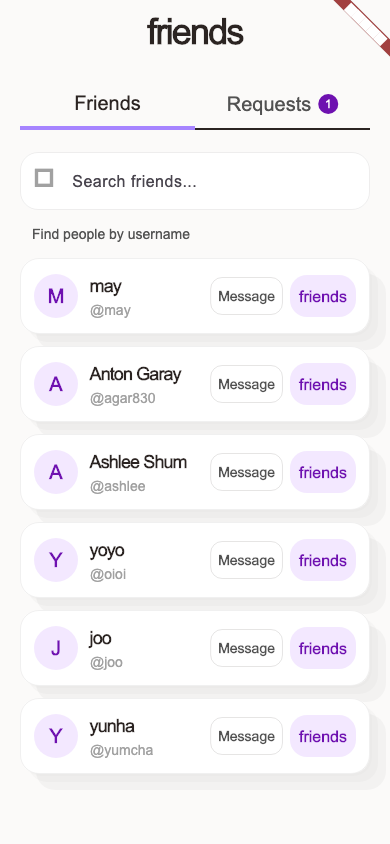
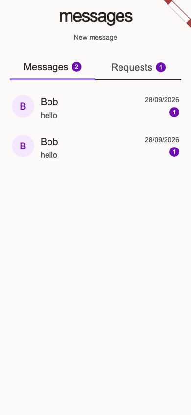
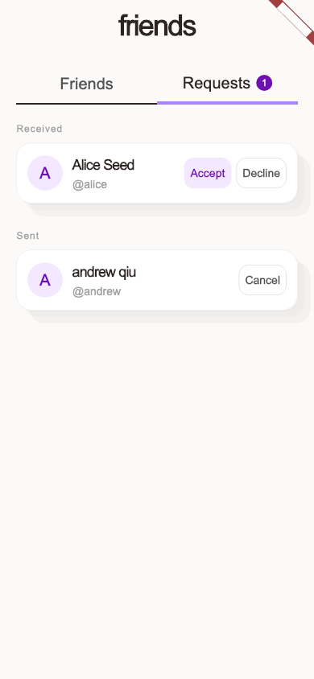
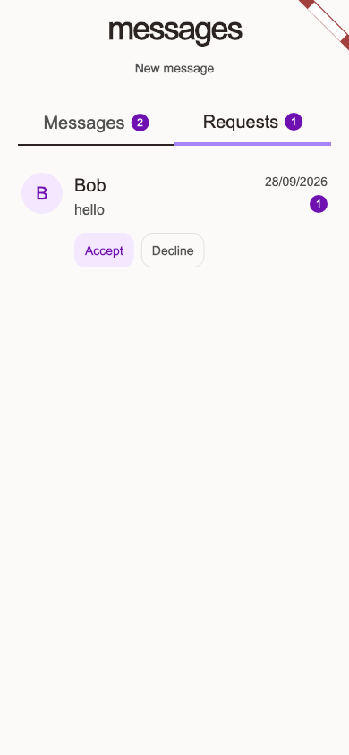

# PR #149 visual review

Screenshots for the restyled Friends and Messages screens in [PR #149](https://github.com/UOA-CS734-S2-2026/project-implementation-may-gan/pull/149). This is a review-only branch. The PNGs do not belong in the application PR.

The web images came from a production-mode Chromium build at 1440x900 and 390x844. Auth and API responses were mocked. The capture followed the Messages width fix. Subsequent changes through social HEAD `6aac3d7` did not alter the web presentation. Browser checks found no console errors or horizontal overflow. Dates use the browser's local time zone. See the [focused web QA report](web-qa-report.md) for the capture results.

The native images came from 390x844 Flutter widget captures after the native list-action fixes. They use fake test data and a substitute font, and show Flutter's debug banner. They are not emulator, phone, authenticated staging, or physical-device proof.

## Web desktop

| Friends | Messages |
| --- | --- |
|  |  |
|  |  |

## Web mobile

| Friends | Messages |
| --- | --- |
|  |  |
|  |  |

The [new-conversation picker](screenshots/web/desktop-new-picker.png) and [new-pair draft](screenshots/web/desktop-new-pair-draft.png) are also included.

## Flutter widget captures

| Friends | Messages |
| --- | --- |
|  |  |
|  |  |
