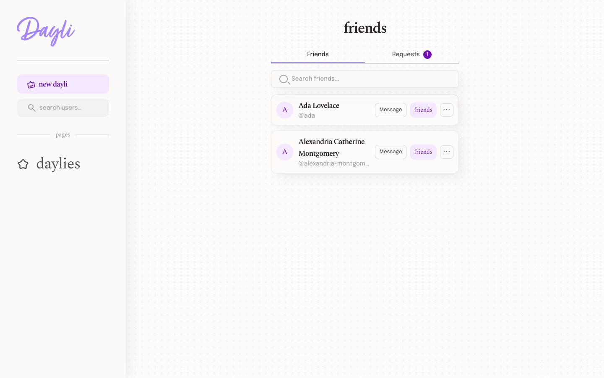
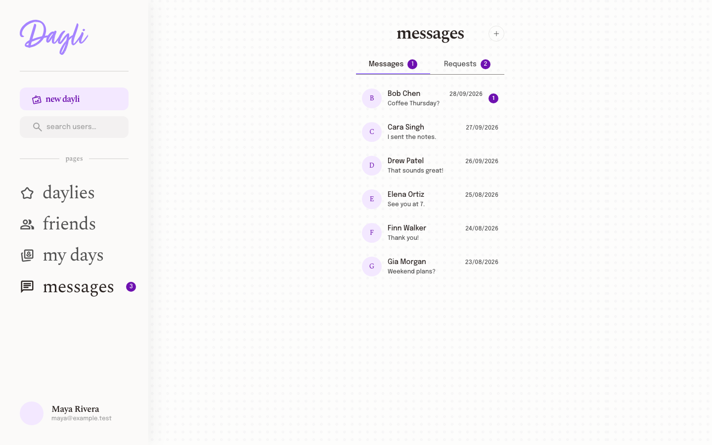
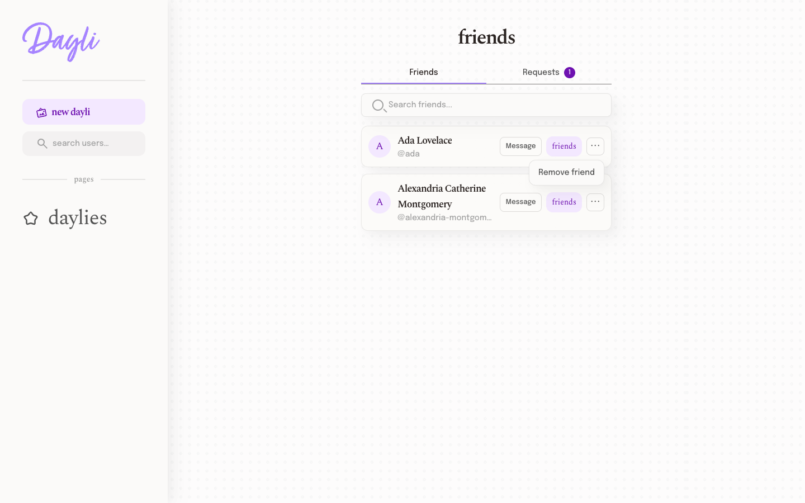
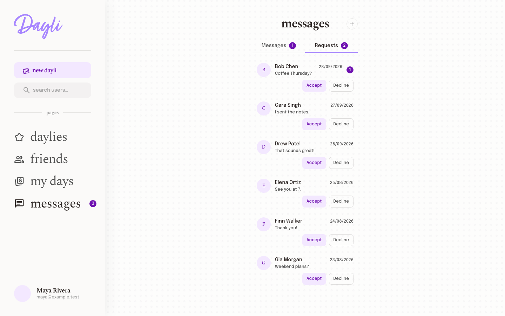
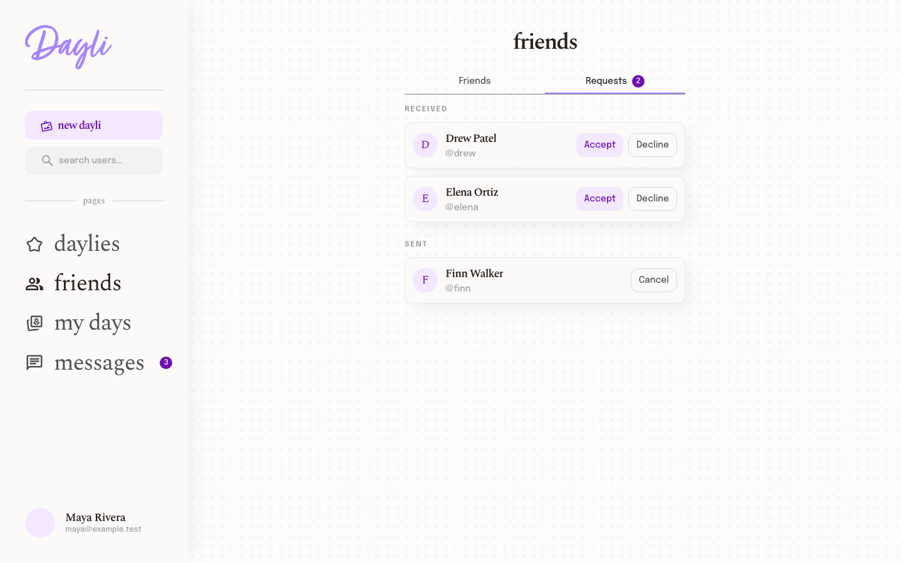
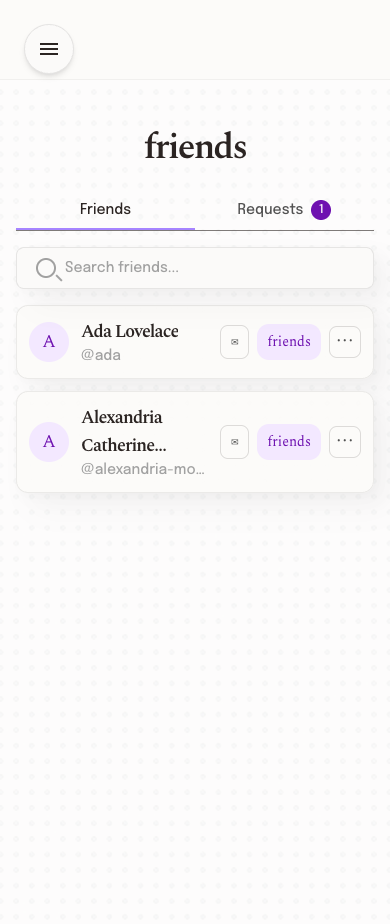
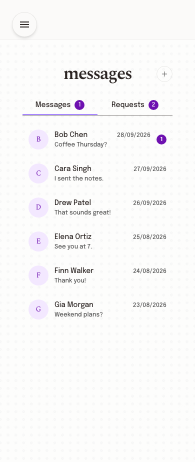
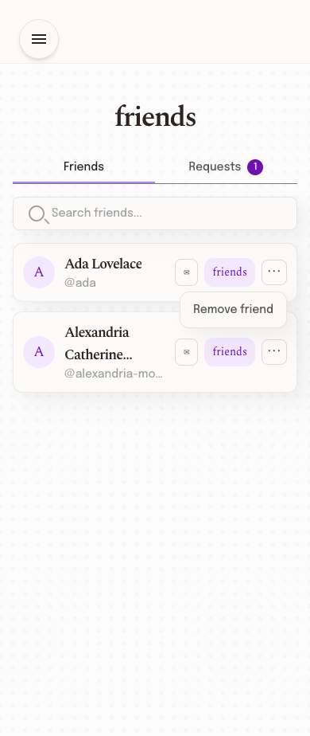
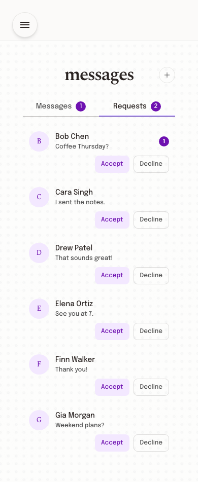
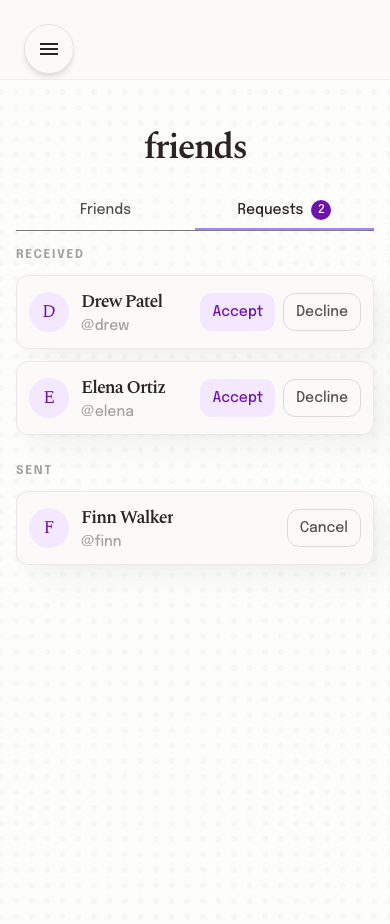

# PR #149 visual review

Screenshots for the restyled Friends and Messages screens in [PR #149](https://github.com/UOA-CS734-S2-2026/project-implementation-may-gan/pull/149). This is a review-only branch. The PNGs do not belong in the application PR.

The Friends images show feature HEAD `f8a0955` in production-mode Chromium at 1440x900 and 390x844. The Messages, Requests and new-conversation images were captured earlier; those screens did not change in the final Friends-menu commit. Auth and API responses were mocked. Browser checks found no console errors or horizontal overflow. The [Friends-menu QA result](friends-menu-qa-report.txt) covers the separate actions button and the inert status badge. The [Messages width check](web-qa-report.md) covers the earlier captures.

Flutter unit and widget tests passed after the menu change. An updated native image with readable text was not available, so the earlier Flutter widget screenshots have been removed. Emulator, phone and authenticated staging checks remain outstanding.

## Web desktop

| Friends | Messages |
| --- | --- |
|  |  |
|  |  |
|  | |

## Web mobile

| Friends | Messages |
| --- | --- |
|  |  |
|  |  |
|  | |

The [new-conversation picker](screenshots/web/desktop-new-picker.png) and [new-pair draft](screenshots/web/desktop-new-pair-draft.png) are also included.
